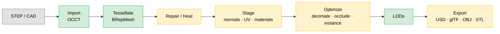

# Fascat Plan

The single planning document for Fascat. For the log of shipped work, see
[CHANGELOG.md](CHANGELOG.md). This file tracks **what the pipeline does today** and
**what is still open**.

## What Fascat Is

A Python library and CLI that converts CAD (STEP, IGES, BREP) into realtime-ready OpenUSD,
glTF/GLB, OBJ, and STL assets. The end-to-end V1 pipeline is implemented and produces
real geometry — not just diagnostics. The goal is solid **CAD → realtime 3D (RT3D)**
basics, refined over time. Matching Unity's Asset Transformer 100% is explicitly a
non-goal; Unity Asset Transformer is used as a reference checklist, not a target.

## Pipeline at a Glance

**Legend** — 🟢 green: fully real · 🟡 amber: real core with an approximate or
metadata-only sub-feature · ⚪ grey: external input.

Backends: OCCT/OCP (CAD + tessellation + BREP healing), xatlas (UV unwrap),
meshoptimizer / fast-simplification (decimation + meshopt compression), usd-core
(USD), built-in glTF/OBJ/STL writers, trimesh + numpy (mesh ops).

## Status: Real vs. Gaps

### Maturity matrix

| Stage | Real & complete | Approximate (refine) | Gap (metadata-only / not implemented) |
| --- | --- | --- | --- |
| **Import** | hierarchy, transforms, colors, metadata, units, repeated-part instances | — | typed PMI, multi-file/multi-root, design variants, IGES, BREP, other non-STEP formats |
| **Tessellate** | sag / angle / min-edge / curvature-adaptive meshing | — | CAD-derived UVs, tessellation-time tangents, free-edge geometry output |
| **Repair / Heal** | vertex merge, dedup, degenerate cleanup, winding fix, small-hole fill, normals; BREP fix-edge / sew | mesh-level hole removal | T-junction sewing, gap stitching, non-manifold cracking, sliver removal, viewer/open-shell orientation |
| **Stage / UV** | normals, tangents, xatlas unwrap, AABB UV, UV copy, material PBR normalize / merge | — | bake-domain repack + padding, island merge / align, seam graph, backend-enforced solver |
| **Materials** | per-face colors + PBR factors preserved | — | raster textures, atlas packing, AO bake, material-library mapping |
| **Optimize** | decimation, instance reconstruction, buffer optimization | sampled occlusion, quality→ratio decimation | error-bounded decimation, weighted decimation, retopology, GPU occlusion |
| **LOD** | real decimated mesh levels | — | occurrence LOD groups, far-LOD bake-to-one-material, switching-distance validation |
| **Export** | USD/USDZ, glTF/GLB (quantize + meshopt), OBJ, STL | — | Draco, KTX2/Basis, real texture files, size-ladder reports, named presets |

### A. Works end-to-end — real geometry

The basics are present and produce a valid RT3D asset:

- **Import** (`io/step.py`, OCCT/OCP): STEP geometry, assembly hierarchy, transforms, colors, metadata, units, repeated-part instances, source-space normalization.
- **Tessellate** (`ops/tessellate.py`, OCCT `BRepMesh`): `sag`, `angle`, `min_edge_length`, `curvature_adaptive`, `preserve_boundaries` all change the real mesh.
- **Repair — mesh** (`mesh.py`): vertex merge (Euclidean union-find), duplicate / degenerate face removal, winding fix (trimesh + inward-shell flip), small-hole fill, normal generation.
- **Heal — BREP** (`ops/heal.py`): `fix_edges`, `unify_tolerances`, `sew_faces` via OCCT `ShapeFix` / `BRepBuilderAPI_Sewing`.
- **Stage** (`ops/stage.py`): normals, tangents, UV unwrap (**xatlas**), AABB/box UV projection, UV copy, material normalize-to-PBR, duplicate-material merge.
- **Optimize** (`ops/optimize.py`): decimation (**meshoptimizer / fast-simplification**), instance reconstruction (real scene rewrite), buffer optimization.
- **LODs** (`ops/lod.py`): real decimated mesh levels per part.
- **Export** (`io/{usd,gltf,obj,stl}.py`): USD/USDZ (usd-core), glTF/GLB with real quantization + meshopt compression, OBJ, STL — all write valid geometry, hierarchy, transforms, and material factors.

### B. Real but approximate — refine candidates

- **Occlusion removal** (`ops/actions.py`): real sampled visibility rays; no acceleration structure / GPU, so thin occluders are imprecise.
- **Hole removal** (`actions.py:190,194`): mesh boundary classification + fill only; closed BREP feature removal not implemented.
- **Decimation `criterion="quality"`**: maps tolerance → target ratio; not true geometric-error-bounded simplification.

### C. Metadata-only / not implemented — the genuine gaps

These exist as options/reports but do **not** change geometry yet:

- **Material / texture baking** (`actions.py:46`): emits constant embedded factor maps only — "raster texture baking is not implemented". No real base-color/normal/roughness/AO images, no real atlas packing. *(Largest fake-but-exists feature.)*
- **UV bake-domain padding/repack** (`stage.py:588`): `padding_status = "metadata_only"`; unwrap runs but no repack/padding pass for lightmap/AO/material-bake UVs.
- **Repair topology backends** (`asset.py:311-313`, `754-755`): T-junction sewing, boundary-gap stitching, non-manifold edge cracking all `"not_implemented"` — counted and reported, never fixed.
- **Orientation strategies** (`asset.py:1155-1163`): viewer-standpoint / open-shell / unstitched-group orientation is `"intent_not_implemented"`; only closed-exterior winding is enforced.
- **Sliver-face removal** (`ops/heal.py`): reported, not performed.

### D. Intentional deferrals — see [Deferrals](#deferrals).

## Roadmap

Open gaps grouped by stage, **not ranked** — pick the next scoped item, then
implement → test → document → commit → push → verify CI/docs.

**Import**
- **IGES input (`.igs`, `.iges`)**: `IGESCAFControl_Reader` is already available in the installed OCP build. Mirrors the STEP reader — same XDE document tree, same node/material/hierarchy extraction. New `IgesReadOptions`, new `fascat/io/iges.py`, format dispatch in `pipeline.py` and `cli.py`. No new dependencies.
- **BREP input (`.brep`)**: OpenCASCADE native format. `BRepTools.Read_s` is already called in `fascat/_ocp.py`. Single-shape, no assembly or colors — creates one root node with one part. New `BrepReadOptions`, new `fascat/io/brep.py`. No new dependencies.
- True multi-file/multi-root import: deterministic multi-root assemblies, shared material/image namespaces, per-member failure warnings.
- Typed AP242 PMI entity extraction + visual annotation geometry.
- Design-variant import.
- Decide mixed BREP construction-curve handling: delete / preserve-as-metadata / tessellate-into-tubes.
- Connect delete-patch import decisions to tessellation-time BREP retention.

**Tessellate**
- CAD-derived UV generation (intrinsic / conformal surface UVs) at tessellation time, not only post-mesh unwrap.
- Tessellation-time tangent generation.
- Optional free-edge geometry output (separate from diagnostics) for wire overlays.
- Auto-apply material / metadata / curvature-driven per-part tessellation criteria (currently advisory-only).

**Repair / Heal**
- T-junction sewing, boundary-gap stitching, non-manifold edge cracking (currently counted only).
- Sliver-face removal, BREP duplicate-face cleanup, tolerance-based overlap / z-fighting cleanup.
- Backend orientation for viewer-standpoint / open-shell / unstitched groups (currently intent-only).
- Optional non-orientable strip cracking before face orientation.
- Open-shell grouping before BREP healing; standalone face/normal-orientation + patch-cleanup expert operations.

**Stage / UV**
- Real UV repack + padding for bake domains (UV1 / lightmap).
- UV island merge + alignment for tileable UV0; seam segmentation + lines-of-interest seam graph.
- Backend-enforced solver (conformal / isometric) and seam / overlap policies (currently intent-only).
- Topology-only connectivity vertex merge with split render attributes (connect topology while preserving hard-edge / UV / material seams).

**Materials & textures**
- Real raster texture baking: base color, roughness, metallic, normal, AO, emissive.
- Real atlas packing (reuse xatlas UVs); first-class image resources (resize, dedupe real files, PNG/JPEG fallback applied to real files).
- AO bake to texture and/or vertex colors → feed decimation weights.
- Material-library import + CAD-material-to-PBR mapping tables + mapping diagnostics.
- High-poly → proxy normal-map baking.

**Optimize**
- Geometric-error-bounded simplification (replace quality-heuristic → ratio mapping).
- AO / user-painted vertex weights as simplification constraints; vertex-color/weight cleanup.
- Occlusion: acceleration structures + optional raster/GPU backend; standard vs advanced params.
- Loose / precise + symmetry / mirror-aware instance reconstruction.
- Retopology / proxy-mesh paths (dual-contouring, field-aligned) + normal-map transfer.

**LOD**
- Occurrence-level LOD groups preserving instance relationships across levels.
- Far-LOD bake to one mesh / one material (one draw call).
- Drive per-LOD material / texture-resolution / culling policy from existing advisories.
- Switching-distance validation + engine-specific LOD export profiles (Unity, Unreal).

**Export**
- Real Draco encoder (or keep `draco=True` rejected).
- Real KTX2/Basis texture output (after first-class images exist).
- Baseline-vs-optimized + compressed-GLB size-ladder reports.
- Named web / mobile / desktop / VR / AR export presets that actually apply compression + resize + cleanup.

**Validation (cross-cutting)**
- Visual before/after preview renders and LOD switching checks.
- Measured engine/runtime load-time, memory, and FPS profiling (today the budgets are numeric only).

## Principles

- Keep the public API small, explicit, and Pythonic.
- Preserve CAD hierarchy, transforms, names, colors, metadata, and instancing by default.
- Make lossy or approximate steps explicit in options, docs, and reports.
- Prefer warnings and partial success over silent data loss.
- Use proven geometry libraries for CAD kernels, tessellation, simplification, UV packing, and USD authoring.
- Work one feature at a time: implement, test, document, commit, push, verify CI/docs.

## Deferrals

Intentionally out of scope until a user need changes the priority:

- **Draco** and **KTX2/Basis** compression — rejected with a clear error until a reliable encoder backend exists.
- Non-STEP CAD formats (beyond IGES and BREP, which are now on the roadmap): Parasolid, JT, CATIA, NX, SolidWorks, IFC, 3MF, QIF.
- Animation / skinning / morph targets / animated GLB passthrough.
- Convex decomposition and physics proxy generation.
- Advanced retopology and subdivision workflows.
- GPU-specific runtime packaging beyond standards-aligned glTF/USD output.

## Operating Checklist

For each planned feature:

1. Confirm the intended behavior in docs or tests first.
2. Keep the change scoped to one user-visible outcome.
3. Add or update focused tests.
4. Update API/reference docs when public behavior changes.
5. Run `make fmt-check`, `make lint`, `make docs`, and `make ci`.
6. Commit with the repo convention.
7. Push and verify GitHub CI and Docs workflows are green.
