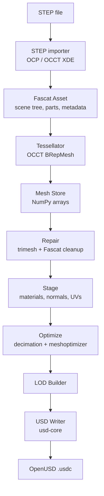
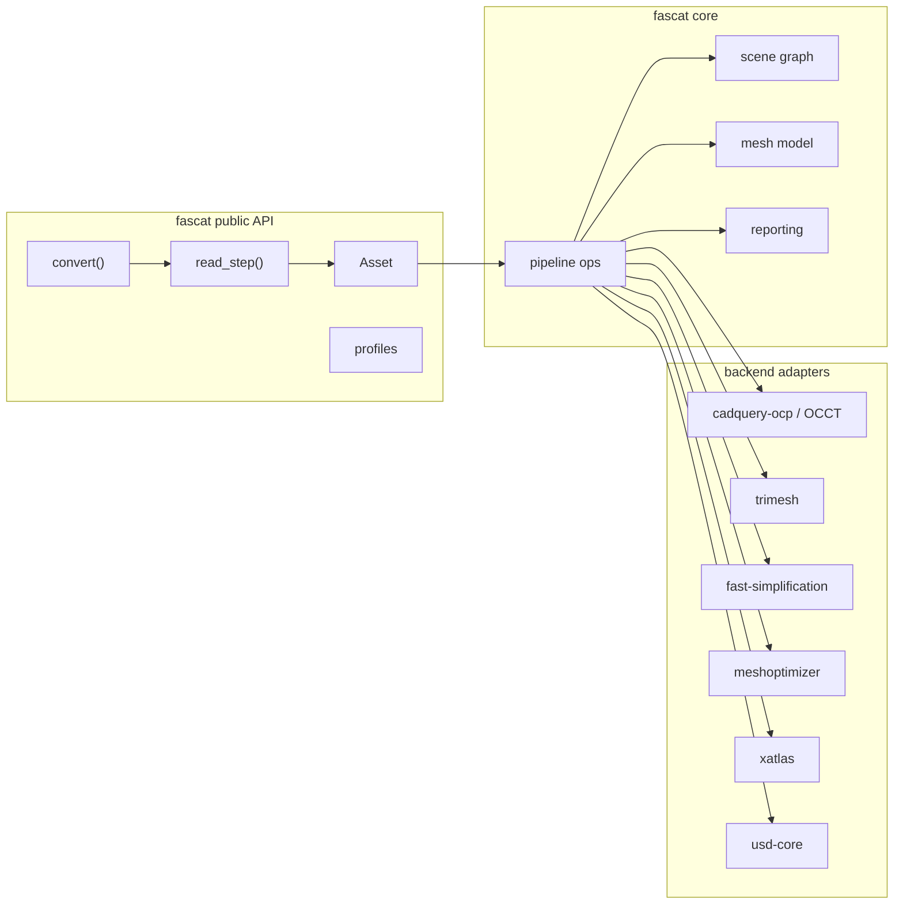

# Fascat Implementation Plan

## 1. Goal

Fascat is a Python library and CLI for converting CAD data into realtime-ready OpenUSD assets.

The first version should support one focused pipeline:

```text
STEP CAD -> imported assembly -> tessellated meshes -> repaired meshes -> staged materials and UVs -> optimized LODs -> OpenUSD
```

Fascat takes guidance from Unity Asset Transformer SDK / Pixyz, but it is not a Pixyz clone. The goal is to define the minimum useful subset for high-quality CAD-to-realtime conversion, while relying on proven geometry libraries instead of reimplementing CAD kernels, tessellators, decimators, UV packers, or USD authoring from scratch.

The public API should feel Pythonic and composable, closer to libraries like Shapely than to the procedural Pixyz-style API.

## 2. Current Repository State

The repository now contains the V1 package, CLI, tests, docs, and release/build wiring described by this plan:

```text
fascat/
  fascat/                  # Python package and CLI implementation
  tests/                   # unit, CLI, STEP, USD, and backend-gated tests
  docs/                    # documentation source
  scripts/                 # documentation build tooling
  .github/workflows/       # CI, release, and pages workflows
  pyproject.toml
  Makefile
```

The license is MIT. `AGENTS.md` is the canonical repository instruction file.

## 3. Design Principles

- Keep the API small, explicit, and Pythonic.
- Preserve CAD structure by default: hierarchy, transforms, names, colors, metadata, and repeated parts.
- Use proven third-party libraries for hard geometry work.
- Make every destructive or lossy step explicit in options and visible in reports.
- Optimize unique parts, not repeated occurrences.
- Generate OpenUSD that is inspectable, standards-aligned, and friendly to realtime runtimes.
- Prefer robust partial success with warnings over silent data loss.
- Keep V1 narrow: STEP in, OpenUSD out.

## 4. Research Summary

Unity Asset Transformer guidance suggests this high-level order:

1. Import source data while preserving hierarchy, metadata, materials, and instancing.
2. Clean and repair imported data before aggressive polygon operations.
3. Tessellate CAD BREP data into renderable meshes.
4. Stage render data: materials, UVs, normals, tangents, and optional baked data.
5. Optimize LOD0 first.
6. Generate LODs from optimized LOD0.
7. Export to the target realtime format.

Fascat should adapt that flow to OpenUSD:

```text
import -> tessellate -> repair -> stage -> optimize -> lods -> export
```

Important Unity references:

- Import: https://docs.unity.com/en-us/asset-transformer-sdk/2026.1/manual/sdktips/import-guidelines
- Stage: https://docs.unity.com/en-us/asset-transformer-sdk/2026.1/manual/sdktips/stage-guidelines
- Optimize: https://docs.unity.com/en-us/asset-transformer-sdk/2026.1/manual/sdktips/optimization-guidelines
- LODs: https://docs.unity.com/en-us/asset-transformer-sdk/2026.1/manual/sdktips/lod-guidelines
- Export: https://docs.unity.com/en-us/asset-transformer-sdk/2026.1/manual/sdktips/export-guidelines
- Tessellate: https://docs.unity.com/en-us/asset-transformer-sdk/2026.1/manual/functions/tessellate
- Repair meshes: https://docs.unity.com/en-us/asset-transformer-sdk/2026.1/manual/functions/repairmeshes
- Merge vertices: https://docs.unity.com/en-us/asset-transformer-sdk/2026.1/manual/functions/mergevertices
- Delete degenerate polygons: https://docs.unity.com/en-us/asset-transformer-sdk/2026.1/manual/functions/deletedegeneratepolygons
- Decimate to target: https://docs.unity.com/en-us/asset-transformer-sdk/2026.1/manual/functions/decimatetotarget
- Unwrap UV: https://docs.unity.com/en-us/asset-transformer-sdk/2026.1/manual/functions/unwrap-uv

## 5. V1 Scope

### Included

- STEP import.
- Assembly hierarchy preservation.
- Part names, transforms, units, colors, and simple metadata where available.
- Repeated part detection and OpenUSD instancing.
- CAD BREP tessellation with sag and angle controls.
- Triangle mesh cleanup:
  - remove unreferenced vertices
  - merge close vertices
  - remove duplicate faces
  - remove degenerate faces
  - fix winding where possible
  - compute normals
  - optional conservative hole filling
- Realtime staging:
  - CAD color to basic PBR material
  - display color fallback
  - optional box-projected UV0
  - optional xatlas UV unwrap/repack
- Optimization:
  - triangle target or ratio decimation
  - preserve instances by default
  - vertex/index buffer optimization
  - geometry/material statistics report
- LOD generation:
  - decimated LOD chain
  - OpenUSD `lod` variant set
- Export:
  - `.usdc` default
  - `.usda` debug output
  - OpenUSD `UsdGeomMesh`, `UsdShade`, `UsdGeomXform`, stage units, up-axis, and default prim

### Deferred

- More CAD formats.
- Occlusion removal.
- Visual footprint.
- AO baking.
- Texture and material baking.
- Billboards.
- Proxy meshes.
- Dual contouring.
- Advanced retopology.
- Convex decomposition.
- Filleting.
- Loop subdivision.
- Region/material merge workflows.
- Texture compression.
- `.usdz` packaging.
- GLB export.

## 6. Architecture





## 7. Proposed Package Layout

```text
fascat/
  pyproject.toml
  README.md
  PLAN.md
  src/
    fascat/
      __init__.py
      asset.py
      mesh.py
      material.py
      options.py
      profiles.py
      report.py
      pipeline.py
      cli.py
      io/
        __init__.py
        step.py
        usd.py
      ops/
        __init__.py
        tessellate.py
        repair.py
        stage.py
        optimize.py
        lod.py
        uv.py
      backends/
        __init__.py
        ocp.py
        trimesh.py
        usd.py
        xatlas.py
  tests/
    test_mesh_repair.py
    test_profiles.py
    test_pipeline_options.py
    test_usd_export.py
    fixtures/
```

This is an implementation target, not a requirement to scaffold all files at once.

## 8. Dependencies

Target Python version:

- Python `>=3.10`

Core dependencies:

- `numpy`: mesh arrays and numeric operations.
- `typing-extensions`: compatibility for modern typing features.
- `rich`: CLI progress and reports.
- `typer`: CLI commands.

Geometry and asset dependencies:

- `cadquery-ocp`: Python bindings to Open CASCADE for STEP import and CAD tessellation.
- `trimesh`: mesh validation and repair helpers.
- `fast-simplification`: triangle reduction.
- `meshoptimizer`: vertex/index optimization.
- `usd-core`: OpenUSD authoring.

Optional dependency:

- `xatlas`: UV unwrap/repack.

Dependency policy:

- Avoid GPL runtime dependencies in core.
- Do not include PyMeshLab in V1 core because of licensing concerns.
- Consider PyMeshLab later as an explicitly optional plugin if the project needs more advanced mesh processing.
- Optional backends must fail with clear errors when requested but unavailable.

## 9. Data Model

### Asset

Top-level object returned by import and pipeline operations.

Fields:

- `root: Node`
- `parts: dict[str, Part]`
- `materials: dict[str, Material]`
- `units: str`
- `meters_per_unit: float`
- `up_axis: Literal["Y", "Z"]`
- `source_path: Path | None`
- `report: Report`

Behavior:

- Methods return a new `Asset` by default.
- `inplace=True` can be added later only if profiling shows it is needed.
- Large mesh arrays may be shared internally when unchanged.

### Node

Represents assembly hierarchy.

Fields:

- `id: str`
- `name: str`
- `children: list[Node]`
- `part_id: str | None`
- `transform: np.ndarray`
- `metadata: dict[str, str]`

### Part

Represents reusable geometry.

Fields:

- `id: str`
- `name: str`
- `source_shape: object | None`
- `mesh: Mesh | None`
- `material_ids: list[str]`
- `metadata: dict[str, str]`
- `fingerprint: str | None`

### Mesh

Triangle mesh container.

Fields:

- `points: np.ndarray`
- `faces: np.ndarray`
- `normals: np.ndarray | None`
- `uvs: dict[int, np.ndarray]`
- `material_indices: np.ndarray | None`
- `face_groups: dict[str, np.ndarray]`
- `metadata: dict[str, str]`

Rules:

- `points` shape is `(N, 3)`, float64 internally.
- `faces` shape is `(M, 3)`, int64 internally.
- USD export can cast to appropriate USD value types.
- Meshes must not contain NaNs, negative face indices, or out-of-range indices after repair.

### Material

Fields:

- `id: str`
- `name: str`
- `base_color: tuple[float, float, float, float]`
- `metallic: float = 0.0`
- `roughness: float = 0.5`
- `opacity: float = 1.0`
- `metadata: dict[str, str]`

### Report

Every pipeline step should append structured entries.

Fields:

- `source_path`
- `started_at`
- `finished_at`
- `steps`
- `warnings`
- `errors`
- `input_stats`
- `output_stats`

Each step should record:

- step name
- options used
- duration
- before/after triangle count
- before/after part count
- warnings

## 10. Public Python API

Primary fluent workflow:

```python
import fascat as fc

asset = fc.read_step("motor.step")

asset = asset.tessellate(
    fc.Tessellation(
        sag=0.1,
        angle=15.0,
        relative=True,
        max_edge_length=None,
    )
)

asset = asset.repair(
    fc.RepairOptions(
        tolerance=0.05,
        merge_vertices=True,
        delete_degenerate=True,
        fix_winding=True,
        fill_small_holes=False,
    )
)

asset = asset.stage(
    fc.StageOptions(
        materials="cad",
        normals=True,
        uv0="box",
        uv1=None,
    )
)

asset = asset.optimize(
    fc.OptimizeOptions(
        target_triangles=500_000,
        preserve_instances=True,
        simplify=True,
        optimize_buffers=True,
    )
)

asset = asset.lods(
    fc.LODOptions(
        ratios=[0.5, 0.25, 0.1],
        mode="variants",
    )
)

asset.write_usd("motor.usdc")
```

One-shot conversion:

```python
import fascat as fc

fc.convert(
    "pump.step",
    "pump.usdc",
    profile=fc.profiles.realtime_desktop(
        tessellation_sag=0.1,
        max_triangles=1_000_000,
        lod_ratios=[0.5, 0.25, 0.1],
    ),
)
```

Functional style:

```python
import fascat as fc

asset = fc.read_step("assembly.step")
asset = fc.tessellate(asset, sag=0.1, angle=15)
asset = fc.repair(asset, tolerance=0.05)
asset = fc.optimize(asset, ratio=0.4)
fc.write_usd(asset, "assembly.usdc")
```

Inspection:

```python
asset = fc.read_step("gearbox.step")

print(asset.report.summary())
print(asset.triangle_count)
print(asset.part_count)
```

## 11. CLI

Commands:

```bash
fascat inspect input.step
fascat convert input.step output.usdc
fascat validate output.usdc
```

Convert example:

```bash
fascat convert input.step
fascat convert input.step output.usdc \
  --profile realtime-desktop \
  --sag 0.1 \
  --angle 15 \
  --target-triangles 500000 \
  --lods 0.5,0.25,0.1
```

Debug output example:

```bash
fascat convert input.step output.usda --debug
```

CLI behavior:

- Default output path is the input path with a `.usdc` suffix when converting a file input.
- Print source stats before processing.
- Print triangle/material/part stats after each major stage.
- Exit non-zero on invalid input, missing backend, or failed USD validation.
- Write a sidecar JSON report when `--report report.json` is supplied.

## 12. Pipeline Details

### Import

Use `cadquery-ocp` and OCCT XDE APIs.

Implementation targets:

- Use `STEPCAFControl_Reader` for STEP assemblies.
- Preserve labels, names, colors, transforms, and units where exposed.
- Traverse XDE document labels into `Node` and `Part`.
- Keep source BREP shapes attached to `Part.source_shape` until tessellation.
- Generate stable IDs from source path, label path, and occurrence index.
- Detect repeated parts by source label first, then by shape/mesh fingerprint later.

### Tessellation

Use OCCT tessellation through OCP.

Options:

```python
Tessellation(
    sag: float = 0.1,
    angle: float = 15.0,
    relative: bool = True,
    max_edge_length: float | None = None,
    create_normals: bool = True,
    keep_brep: bool = False,
)
```

Rules:

- Tessellate each unique `Part` once.
- Reuse tessellated mesh for repeated occurrences.
- Default UV generation is disabled during tessellation.
- Drop BREP after tessellation unless `keep_brep=True`.

### Repair

Repair runs after tessellation and before decimation.

Default repair sequence:

1. Remove NaN/Inf points and affected faces.
2. Remove unreferenced vertices.
3. Merge vertices within tolerance.
4. Remove duplicate faces.
5. Remove degenerate faces by area threshold.
6. Fix winding where topology allows.
7. Compute or refresh normals.
8. Optionally fill small simple holes.

Hole filling must be conservative. It should be disabled by default and limited to small boundary loops when enabled.

### Stage

Staging prepares render data before optimization and LOD export.

Material rules:

- Convert CAD colors to simple `Material`.
- Honor material staging modes:
  - `materials="cad"` keeps material bindings.
  - `materials="display"` keeps imported colors as `displayColor` only.
  - `materials="none"` clears imported materials.
- Use `UsdPreviewSurface` on export.
- Bind materials per mesh or per face subset if needed.
- Use `displayColor` as fallback.

UV rules:

- `uv0="box"` generates local AABB box-projected UVs.
- `uv0=None` skips UV generation.
- `uv1="unwrap"` requires `xatlas`.
- Repacking and normalization are only implemented for xatlas-backed UVs in V1.

Normals:

- Generate smooth normals by default.
- Preserve hard edges later.
- V1 can use angle-weighted normals.

### Optimize

Options:

```python
OptimizeOptions(
    target_triangles: int | None = None,
    ratio: float | None = None,
    preserve_instances: bool = True,
    simplify: bool = True,
    optimize_buffers: bool = True,
)
```

Rules:

- Optimize LOD0 before generating LODs.
- If both `target_triangles` and `ratio` are set, `target_triangles` wins.
- Preserve repeated parts unless explicitly disabled.
- Decimate each unique mesh, not each occurrence.
- Run mesh validation after simplification.
- Run meshoptimizer after decimation.

### LODs

Options:

```python
LODOptions(
    ratios: list[float] = [0.5, 0.25, 0.1],
    mode: Literal["variants"] = "variants",
)
```

Rules:

- LOD0 is the optimized asset.
- LOD1+ are generated by simplifying unique meshes from LOD0.
- Triangle counts must be monotonic.
- Export as an OpenUSD `lod` variant set with variants `lod0`, `lod1`, `lod2`, etc.
- Default selected variant is `lod0`.

### USD Export

Use `usd-core`.

Rules:

- Default output is `.usdc`.
- `.usda` is supported for debugging.
- Stage metadata:
  - `defaultPrim`
  - `metersPerUnit`
  - `upAxis`
- Mesh prims:
  - `UsdGeomMesh`
  - `points`
  - `faceVertexCounts`
  - `faceVertexIndices`
  - `subdivisionScheme = "none"`
  - normals when available
  - `primvars:st` for UV0
  - material bindings
  - extent
- Materials:
  - `UsdShade.Material`
  - `UsdPreviewSurface`
- Instances:
  - identical parts should export as references or instanceable prims.
- Names:
  - sanitize all names into valid USD identifiers while preserving original names in metadata.

## 13. Profiles

Profiles provide practical defaults.

```python
fc.profiles.inspect_only()
fc.profiles.realtime_desktop()
fc.profiles.realtime_web()
```

Initial profile defaults:

| Profile | Sag | Angle | Target Triangles | UVs | LODs |
| --- | ---: | ---: | ---: | --- | --- |
| `inspect_only` | none | none | none | none | none |
| `realtime_desktop` | `0.1` | `15` | `1_000_000` | box UV0 | `0.5, 0.25, 0.1` |
| `realtime_web` | `0.2` | `20` | `250_000` | box UV0 | `0.5, 0.25` |

## 14. Test Plan

Unit tests:

- Asset, node, part, and material constructors/copies isolate mutable containers while preserving new-asset semantics.
- Report and report-step constructors/copies isolate mutable step, warning, error, and stats containers.
- Missing backend tests assert OCP, USD, and xatlas paths fail with clear errors.
- Mesh removes unreferenced vertices.
- Mesh removes degenerate triangles.
- Mesh merges close vertices using tolerance.
- Mesh removes duplicate faces.
- Mesh computes normals without NaNs.
- Mesh repair removes negative and out-of-range face indices before later cleanup.
- Mesh validation rejects out-of-range indices.
- Mesh enforces `max_edge_length` subdivision.
- Hole filling stays disabled for open planar sheets and limited to small non-planar boundaries.
- Repair sequence computes normals before optional hole filling and refreshes them when holes are filled.
- Mesh dictionaries expose material-index and face-group summaries.
- Mesh preserves UVs and material indices through buffer optimization.
- Mesh preserves material indices and face groups when filtering faces during repair.
- Mesh preserves material indices and face groups when winding repair reorders faces.
- Mesh validation rejects invalid face-group indices.
- `xatlas` unwrap tests are marked with `pytest.mark.requires_xatlas`.

Pipeline tests:

- `Tessellation`, `RepairOptions`, `StageOptions`, `OptimizeOptions`, and `LODOptions` validate bad inputs.
- Profiles produce deterministic option sets matching the documented default table.
- Operation reports include before/after counts across tessellate, repair, stage, optimize, and LOD operations.
- Import and validation report steps retain asset-level before/after statistics.
- Operation reports attach warnings to the step that produced them.
- Conversion reports include timed write and validation steps.
- Direct `Asset.write_usd()` and public `fc.write_usd()` calls record timed write steps and attach failure reports.
- Conversion reports record errors and the failed write or validation step before raising.
- Conversion progress callbacks receive source and per-stage stats.
- Repeated parts can be preserved or duplicated per occurrence.
- Optimization tests assert target triangle budgets take precedence over ratio.
- Optimization tests assert target triangle budgets are allocated across unique parts without overshooting when feasible.
- Optimization reports warn when a target is below the one-triangle-per-unique-mesh minimum.
- Optimization validates simplification output before buffer optimization and runs buffer optimization on decimated meshes.
- LOD reports and final conversion output stats include generated LOD mesh, vertex, and triangle totals.
- Staging tests assert `uv0=None` skips UV generation and `normals=False` does not generate missing normals.
- Functional API wrappers cover tessellate, stage, optimize, and LOD operations.
- Public node dictionaries preserve transforms.

USD tests:

- Export a generated cube mesh to `.usda`.
- Reopen with `usd-core`.
- Assert `subdivisionScheme = "none"`.
- Assert stage units and up-axis are authored.
- Assert face counts, indices, and points are valid.
- Assert materials bind correctly through applied `MaterialBindingAPI` schemas and authored `UsdPreviewSurface` shader inputs.
- Assert UV0 primvars, normals, and sanitized-name original metadata are authored.
- Assert sanitized occurrence prims preserve original names and node IDs in metadata.
- Assert sanitized prototype, material, and per-face subset prims preserve original names and IDs in metadata.
- Assert sanitized occurrence, prototype, material, and per-face subset name collisions are disambiguated.
- Assert non-identity node transforms are authored as USD Xform ops.
- Assert mesh extents are authored.
- Assert both `Asset.write_usd()` and `fc.write_usd()` write valid stages.
- Assert `displayColor` fallback is authored.
- Assert USD validation follows instanceable repeated-part prototypes.
- Assert per-face material subsets are authored when material indices require them.
- Assert LOD variants exist with `lod0` selected when requested.
- Assert USD validation checks every authored `lod` variant, not only the selected default variant.
- Mark USD-backed tests with `pytest.mark.requires_usd`.

STEP tests:

- Add fixtures only if license-clean.
- Start with generated/simple STEP fixtures.
- Test hierarchy, names, units, color import, and repeated part detection.
- Test generated STEP assemblies preserve repeated occurrences and non-identity transforms through USD instancing.
- Test a colored STEP fixture imports CAD colors and exports them as visible USD material/displayColor data.
- Test `Tessellation.max_edge_length` on a STEP-backed tessellation path.
- Test `Tessellation.keep_brep` controls source-shape retention after tessellation.
- Test stable STEP IDs include source identity.
- Test STEP shape fingerprints are stable across repeated imports of the same file.
- Test importer part identity prefers matching source labels, then matching shape and material fingerprints before tessellation.
- Test STEP face color material plans map to mesh material indices for USD subsets.
- Test tessellation reuses matching source-shape meshes while keeping distinct face-material assignments separate.
- Test tessellation dedupe preserves distinct per-face material assignments.
- Mark OCP-backed tests with `pytest.mark.requires_ocp`.

CLI tests:

- `fascat --help`
- `fascat inspect fixture.step`
- `fascat inspect --json fixture.step` exposes profile options, hierarchy root, transforms, parts, materials, and report data.
- `fascat inspect` and `fascat validate` missing-backend failures exit non-zero with clear errors.
- `fascat inspect -`, `fascat convert - -`, and `fascat validate -` exercise real process stdin/stdout streams.
- `fascat convert fixture.step` defaults to binary `.usdc` output and validates it.
- `fascat convert fixture.step output.usda --debug` writes debug USD metadata and validates.
- `fascat validate output.usda`
- `fascat convert` rejects `--debug` with binary `.usdc`.
- `fascat convert --dry-run` rejects unsorted LOD ratios.
- `fascat convert` emits source and per-stage progress on stderr.
- `fascat convert` validates generated USD before reporting success.
- `fascat convert --report` writes a failure report sidecar when conversion exposes one, including generated USD validation failures.
- `fascat convert --materials` exercises CAD material, displayColor-only, and no-material staging modes through generated USD output.

## 15. Milestones

### Milestone 1: Package Skeleton

- Add `pyproject.toml`.
- Add `fascat`.
- Add typed core dataclasses.
- Add `pytest`, `ruff`, and basic CI-ready config.
- Add README quickstart.

### Milestone 2: Mesh Core

- Implement `Mesh`.
- Implement validation and repair basics.
- Add generated cube/sphere fixtures.
- Add mesh tests.

### Milestone 3: USD Export

- Implement `.usda` and `.usdc` export.
- Add material export.
- Add stage units and up-axis.
- Add USD validation tests.

### Milestone 4: STEP Import and Tessellation

- Implement OCP backend.
- Import STEP assembly tree.
- Extract colors, names, transforms, and units.
- Tessellate unique parts.
- Add OCP-gated integration tests.

### Milestone 5: Optimization and LODs

- Add decimation.
- Add meshoptimizer path.
- Add OpenUSD LOD variants.
- Add monotonic LOD tests.

### Milestone 6: CLI and Reports

- Implement `fascat inspect`, `fascat convert`, and `fascat validate`.
- Add JSON report output.
- Document profiles and examples.

## 16. Acceptance Criteria for V1

Fascat V1 is done when:

- A user can run `fascat convert model.step model.usdc`.
- The output USD opens through `usd-core`.
- Meshes are polygonal USD meshes with `subdivisionScheme = "none"`.
- CAD hierarchy is represented with USD Xforms.
- CAD colors become visible materials or display colors.
- Repeated CAD parts are not blindly duplicated.
- LOD variants are generated when requested.
- The pipeline emits a useful report with source counts, output counts, warnings, and timings.
- Backend-free core tests pass without CAD/USD/xatlas backends installed.
- OCP/USD/xatlas integration tests pass when backend dependencies are installed.

## 17. Open Questions

- Should V1 default to preserving CAD Z-up, or convert to Y-up for certain realtime engines?
- Should generated LODs live in variant sets only, or should Fascat also support separate payload files per LOD?
- Should material assignment stay purely color-based in V1, or include simple heuristics for metal/roughness based on CAD metadata?
- Should `.usdz` packaging be a near-term V1.1 milestone or wait until texture/material baking exists?
