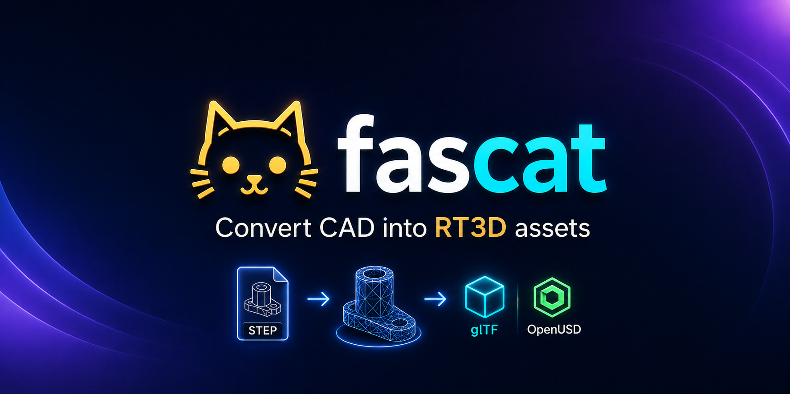
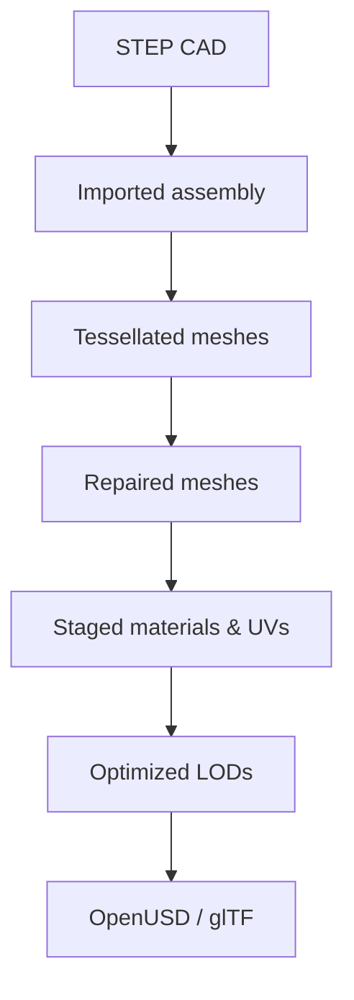

<p align="center">
  
</p>

<p align="center">
  <a href="https://github.com/pavelsimo/fascat/releases"></a>
  <a href="LICENSE"></a>
  <a href="https://python.org"></a>
  <a href="https://pypi.org/project/fascat"></a>
  <a href="https://github.com/pavelsimo/homebrew-tap"></a>
  <a href="https://deepwiki.com/pavelsimo/fascat"></a>
</p>

Fascat is a Python library and CLI for converting CAD data into realtime-ready OpenUSD and glTF assets.



## Installation

### Homebrew (macOS / Linux)

```bash
brew tap pavelsimo/homebrew-tap
brew install fascat
```

### pip / pipx

```bash
pipx install fascat
# or
pip install fascat
```

## Quick Start

```bash
# Show help
fascat --help
fascat help convert

# Print version
fascat version

# Inspect a STEP assembly
fascat inspect motor.step
fascat --json inspect motor.step

# Convert STEP to binary OpenUSD
fascat convert motor.step
fascat convert motor.step motor.usdc --profile realtime-desktop

# Convert STEP to binary glTF for VR/runtime engines
fascat convert motor.step motor.glb --profile virtual-reality
fascat convert motor.step motor.glb --profile mixed-reality

# Tune tessellation, UVs, optimization, and LODs
fascat convert motor.step motor.usdc \
  --sag 0.1 \
  --angle 15 \
  --max-edge-length 25 \
  --target-triangles 500000 \
  --materials display \
  --uv1 box \
  --lods 0.5,0.25,0.1

# Preview a conversion without writing files
fascat convert motor.step motor.usdc --dry-run

# Emit a debuggable ASCII USD and report
fascat convert motor.step motor.usda --debug --report report.json

# Validate generated output
fascat validate motor.usdc
fascat validate motor.glb
```

## Commands

| Command | Description |
|---------|-------------|
| `fascat inspect input.step` | Inspect a STEP assembly before conversion |
| `fascat convert input.step [output.usdc]` | Convert STEP CAD into OpenUSD or glTF |
| `fascat validate output.usdc` | Validate generated USD or glTF output |
| `fascat help [command]` | Show top-level or command-specific help |
| `fascat version` | Print version and exit |

Fascat follows standard CLI stream conventions: primary output and JSON go to stdout, while errors and per-stage conversion progress go to stderr. Conversion validates the generated asset before reporting success. File arguments accept `-` for stdin/stdout where meaningful.

## Python API

```python
import fascat as fc

asset = fc.read_step("motor.step")

asset = asset.tessellate(
    fc.TessellationOptions(
        sag=0.1,
        sag_ratio=None,
        angle=15.0,
        relative=True,
        max_edge_length=None,
        max_polygon_length=None,
        free_edge_report=False,
        reuse_existing_meshes=True,
    )
)

asset = asset.repair(
    fc.RepairOptions(
        tolerance=0.05,
        merge_vertices=True,
        delete_degenerate=True,
        fix_winding=True,
        fill_small_holes=False,
    )
)

asset = asset.stage(
    fc.StageOptions(
        materials="cad",
        normals=True,
        uv0="box",
        uv1=None,
    )
)

asset = asset.optimize(
    fc.OptimizeOptions(
        target_triangles=500_000,
        preserve_instances=True,
        simplify=True,
        optimize_buffers=True,
    )
)

asset = asset.lods(
    fc.LODOptions(
        ratios=[0.5, 0.25, 0.1],
        mode="variants",
    )
)

asset.write_usd("motor.usdc")
asset.write_gltf("motor.glb")
```

## Docs

Full documentation at **[pavelsimo.github.io/fascat](https://pavelsimo.github.io/fascat)**.

## License

MIT
