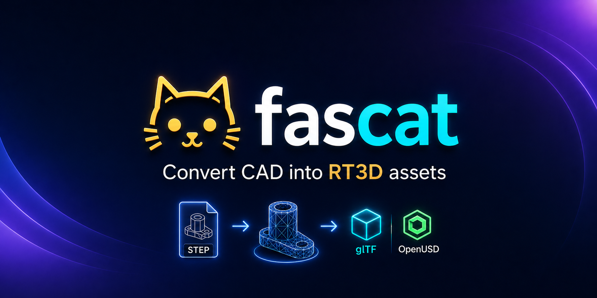
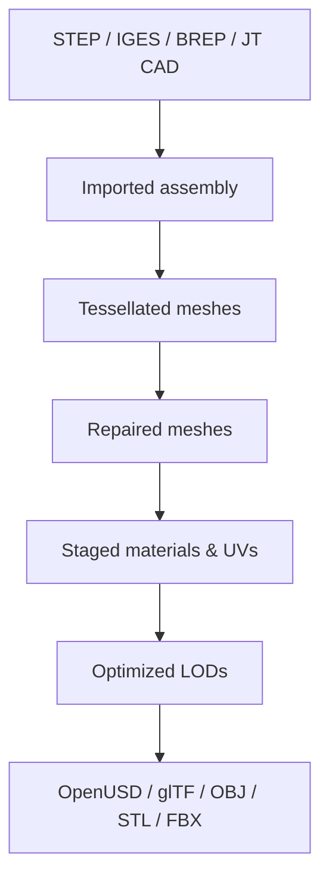

<p align="center">
  
</p>

<p align="center">
  <a href="https://github.com/pavelsimo/fascat/releases"></a>
  <a href="LICENSE"></a>
  <a href="https://python.org"></a>
  <a href="https://pypi.org/project/fascat"></a>
  <a href="https://deepwiki.com/pavelsimo/fascat"></a>
</p>

Fascat is a Python library and CLI for converting STEP, IGES, OpenCASCADE
BREP, and JT CAD into realtime-ready OpenUSD, glTF, OBJ, STL, and FBX assets.


```mermaid
flowchart TD
    A["STEP / IGES / BREP / JT CAD"] --> B["Imported assembly"]
    B --> C["Tessellated meshes"]
    C --> D["Repaired meshes"]
    D --> E["Staged materials & UVs"]
    E --> F["Optimized LODs"]
    F --> G["OpenUSD / glTF / OBJ / STL / FBX"]
```

## Installation

### pip / pipx

```bash
pipx install fascat
# or
pip install fascat
```

## Quick Start

```bash
# Show help
fascat --help
fascat help convert

# Print version
fascat version

# Inspect a CAD assembly
fascat inspect motor.step
fascat --json inspect motor.step

# Convert STEP to binary OpenUSD
fascat convert motor.step
fascat convert motor.step motor.usdc --profile realtime-desktop

# Convert STEP to binary glTF for VR/runtime engines
fascat convert motor.step motor.glb --profile virtual-reality
fascat convert motor.step motor.glb --profile mixed-reality

# Convert JT 8.x/9.x/10.x tessellation to GLB and import all stored JT LODs
fascat convert assembly.jt assembly.glb --jt-lod-selection all

# Tune tessellation, UVs, optimization, and LODs
fascat convert motor.step motor.usdc \
  --sag 0.1 \
  --angle 15 \
  --max-edge-length 25 \
  --target-triangles 500000 \
  --materials display \
  --uv1 box \
  --lods 0.5,0.25,0.1

# Preview a conversion without writing files
fascat convert motor.step motor.usdc --dry-run

# Emit a debuggable ASCII USD and report
fascat convert motor.step motor.usda --debug --report report.json

# Validate generated output
fascat validate motor.usdc
fascat validate motor.glb

# Render multi-angle turntable previews of the result
fascat validate motor.glb --turntable-dir views/
```

## Commands

| Command | Description |
|---------|-------------|
| `fascat inspect input.step` | Inspect a CAD assembly before conversion |
| `fascat convert input.step [output.usdc]` | Convert STEP, IGES, BREP, or JT CAD into OpenUSD, glTF, OBJ, STL, or FBX |
| `fascat validate output.usdc` | Validate generated USD, glTF, OBJ, STL, or FBX output |
| `fascat help [command]` | Show top-level or command-specific help |
| `fascat version` | Print version and exit |

Fascat follows standard CLI stream conventions: primary output and JSON go to stdout, while errors and per-stage conversion progress go to stderr. Conversion validates the generated asset before reporting success. File arguments accept `-` for stdin/stdout where meaningful.

## Python API

```python
import fascat as fc

asset = fc.read_step("motor.step")          # or read_iges(...) / read_brep(...) / read_jt(...)

asset = (
    asset.tessellate(sag=0.1, angle=15.0)
    .repair(tolerance=0.05)
    .stage(materials="cad", uv0="box")
    .optimize(target_triangles=500_000)
    .lods([0.5, 0.25, 0.1])
)

asset.write_usd("motor.usdc")
asset.write_gltf("motor.glb")
```

Keyword arguments mirror each operation's `*Options` dataclass; pass a prebuilt
options object instead when you prefer (`asset.repair(fc.RepairOptions(tolerance=0.05))`).

## Agentic Skill

[`skills/cad-to-rt3d`](skills/cad-to-rt3d/SKILL.md) is an agentic skill that
automates the whole CAD → RT3D tuning loop: it converts with a target profile, validates geometry
quality, renders the result from multiple turntable angles, compares each view
against a high-fidelity reference conversion, and adjusts fascat flags
iteration by iteration until the asset passes both deterministic gates
(topology, triangle and file-size budgets — checked by
[`scripts/gates.py`](skills/cad-to-rt3d/scripts/gates.py)) and a visual
inspection of the renders.

Open this repository in your coding agent (or copy the skill folder into your
own project) and ask, for example:

> Use the cad-to-rt3d skill to convert motor.step for realtime-web.

Every iteration's settings, reports, and renders are kept in a
`<output>.fascat-work/` directory, so the tuning history stays auditable. The
turntable rendering it relies on is plain `fascat validate --turntable-dir` —
see the [CLI reference](https://pavelsimo.github.io/fascat/reference.html) for
the flags.

## Docs

Full documentation at **[pavelsimo.github.io/fascat](https://pavelsimo.github.io/fascat)**.

## License

MIT
