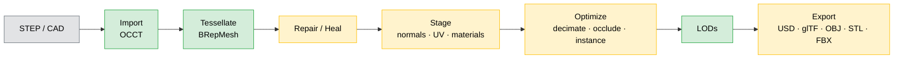

# Fascat Plan

The single planning document for Fascat. For the log of shipped work, see
[CHANGELOG.md](../CHANGELOG.md). This file tracks **what the pipeline does today** and
**what is still open**.

## What Fascat Is

A Python library and CLI that converts CAD (STEP, IGES, BREP) into realtime-ready OpenUSD,
glTF/GLB, OBJ, STL, and FBX assets. The end-to-end V1 pipeline is implemented and produces
real geometry — not just diagnostics. The goal is solid **CAD → realtime 3D (RT3D)**
basics, refined over time. Matching Unity's Asset Transformer 100% is explicitly a
non-goal; Unity Asset Transformer is used as a reference checklist, not a target.

## Pipeline at a Glance

**Legend** — 🟢 green: fully real · 🟡 amber: real core with an approximate or
metadata-only sub-feature · ⚪ grey: external input.

Backends: OCCT/OCP (CAD + tessellation + BREP healing), xatlas (UV unwrap
and packing), meshoptimizer / fast-simplification (decimation + meshopt
compression), Pillow (raster texture baking), glTF Transform + ktx2-encoder
(Draco and KTX2/Basis export), usd-core (USD), built-in glTF/OBJ/STL/FBX
writers, trimesh + numpy (mesh ops).

## Status: Real vs. Gaps

### Maturity matrix

| Stage | Real & complete | Approximate (refine) | Gap (metadata-only / not implemented) |
| --- | --- | --- | --- |
| **Import** | STEP hierarchy, transforms, colors, metadata, units, repeated-part instances; explicit multi-root STEP path-list import; quoted external-reference STEP graph discovery/merge from a master file with repeated reference occurrences preserved; common textual AP242 PMI dimension/location/tolerance/datum/note import plus semantic reference graph with common target/callout/annotation-associativity/tolerance-zone support records and deterministic glTF/USD export marker/text geometry; construction-line delete/preserve/tube policy including free construction edges split from mixed face+curve shapes; IGES XDE hierarchy/material import; native BREP single-shape import | deeper vendor-specific external-reference placement transforms; STEP design-variant/effectivity metadata detection/reporting plus name/reference/effectivity-value/range geometry filtering, simple boolean condition gating including named boolean/logical representation items and explicit boolean variable assignments, equality/not-equality expressions, numeric comparisons/intervals over selected maths variables including simple numeric arithmetic/function expression operands, rational representation items, expression-extension numeric values, elementary trig/log/exp numeric functions including binary `ATAN_FUNCTION`, and odd-function integer conditions, string `LIKE` expressions over selected string variables including simple concat/substring/index/format/expression-extension/length/value expression operands, AP242 maths boolean variables, effectivity relationship links, product-definition/configuration effectivity usage targets, applied effectivity/ineffectivity-assignment targets, effectivity context-assignment targets, conditional concept-feature/effectivity gating, and conditional target gating when labels match imported product names; full AP242 PMI semantic coverage and graphical presentation reconstruction | full AP242 conditional/effectivity geometry evaluation, other non-STEP formats |
| **Tessellate** | sag / angle / min-edge / curvature-adaptive meshing, material/metadata/curved-BREP-driven detail-adaptive per-part criteria, CAD UV extraction/projected fallback, tessellation-time tangents, free-edge geometry metadata, tessellation-time source BREP cleanup including imported-mesh reuse | CAD UV projection fallback | intrinsic/conformal CAD UV solver |
| **Repair / Heal** | vertex merge, dedup, degenerate cleanup, winding fix, small-hole fill, normals; mesh T-junction sewing, boundary-gap stitching, non-manifold cracking, sliver removal, viewer/open-shell orientation; BREP open-shell grouping, fix-edge / sew / same-domain cleanup / coplanar overlap cleanup | mesh-level hole removal, open-shell component orientation | non-orientable strip cracking |
| **Stage / UV** | normals, tangents, xatlas unwrap + bake-domain packing/padding, AABB UV, UV copy, seam graph metadata, material PBR normalize / merge | solver policy intent | island merge / align, backend-enforced solver controls |
| **Materials** | per-face colors + PBR factors preserved, first-class image resources, raster material atlas baking, alpha/effective-opacity export cleanup, source image resize/dedupe/PNG-JPEG fallback processing, JSON/MTL/ZIP vendor material-library import | source texture sidecar extraction, CAD material-name PBR rule mapping, sampled AO bake | high-poly transfer, closed/proprietary vendor material-library containers |
| **Optimize** | decimation, quality target-error simplification, painted/AO protected-face decimation constraints, instance reconstruction, buffer optimization | sampled occlusion | continuous weighted decimation, retopology, GPU occlusion |
| **LOD** | real decimated mesh levels, occurrence-aware LOD metadata, far-LOD one-material bake policy, engine switch-distance validation, scene-level far proxy mesh, Unity `MSFT_lod` and Unreal separate-node glTF export profiles | per-part and scene proxy bake policies | measured engine validation for exported LOD profiles |
| **Export** | USD/USDZ, glTF/GLB (quantize + meshopt + Draco + KTX2/Basis), GLB size-ladder reports, named export presets, OBJ, STL, FBX, real baked texture images | — | — |
| **Validation** | output validators, geometry analysis, profile budget estimates, optional headless browser/WebGL glTF runtime measurement, optional browser/WebGL rendered screenshots for supported glTF/GLB primitives with quantized attribute support, Draco decode via glTF Transform, meshopt fallback-buffer support, meshopt-only/no-fallback decode via local meshoptimizer, default Python `alktx2` KTX2/Basis texture decode on supported Python 3.11+ Linux/Windows x86_64 installs with glTF Transform plus KTX-Software fallback, optional KHR_texture_basisu fixtures with PNG fallback screenshots, base-color texture sampling, and compressed-extension preflight diagnostics, optional packaged or project-backed Unity/Unreal runtime harness drivers with Unity/glTFast preview screenshots/FPS, Unreal commandlet geometry-rasterized GLB preview PNG/FPS with backend/limitation reporting, custom-harness preview artifact reporting, engine-preview baseline image-diff thresholds, deterministic software preview PNGs and LOD contact sheets, bundled runtime parity GLB/software-baseline fixture generation for PBR material, texture-map, KTX2/Basis fallback, normal/lighting checks, Unity `MSFT_lod` profile, and Unreal separate-node LOD profile, plus local capture/promote/require/audit workflow for browser/Unity/Unreal target goldens | browser runtime harness uses a bounded triangle proxy workload; browser KTX2/Basis texture decode is fallback-free by default on supported alktx2 wheel platforms and still depends on external KTX-Software or PNG fallbacks elsewhere; packaged Unity preview is a fixed multi-frame camera render; packaged Unreal preview is a deterministic commandlet GLB geometry/baseColorFactor rasterizer with fixed-frame software benchmark rather than a full scene/material/texture renderer; target-golden validation and coverage audits exist but the repo still needs checked-in real engine material/lighting and LOD-profile image corpora; preview renderer is orthographic software shading | full Unreal scene renderer screenshots/FPS, cross-platform fallback-free KTX2/Basis texture decode, and checked-in engine-specific Unity/Unreal material/lighting and LOD-profile golden corpora |

### A. Works end-to-end — real geometry

The basics are present and produce a valid RT3D asset:

- **Import** (`io/step.py`, `io/iges.py`, `io/brep.py`, OCCT/OCP): STEP geometry, explicit multi-root STEP path-list import, master STEP quoted external-reference graph discovery/merge with repeated external reference occurrences preserved, STEP/IGES assembly hierarchy where exposed, transforms, colors, metadata, units, repeated-part instances, common textual AP242 PMI dimension/location/generic and named geometric-tolerance/datum/note import plus semantic reference graph with tolerance-zone support records, native BREP single-shape import, source-space normalization, sidecar source texture reference extraction, and first-pass CAD material-name PBR mapping.
- **Tessellate** (`ops/tessellate.py`, OCCT `BRepMesh`): `sag`, `angle`, `min_edge_length`, `curvature_adaptive`, material/metadata/curved-BREP-driven detail-adaptive per-part settings, `preserve_boundaries`, CAD UV extraction/projected fallback, tessellation-time tangents, free-edge geometry metadata, and source BREP cleanup all change or annotate the real mesh.
- **Repair — mesh** (`mesh.py`): vertex merge (Euclidean union-find), duplicate / degenerate face removal, T-junction sewing, boundary-gap stitching, non-manifold edge cracking, sliver-face removal, winding fix (trimesh + inward-shell flip), viewer/open-shell orientation, small-hole fill, normal generation.
- **Heal — BREP** (`ops/heal.py`): `fix_edges`, `unify_tolerances`, `sew_faces`, same-domain face/edge cleanup, and coplanar overlap/z-fighting face cleanup via OCCT `ShapeFix`, `BRepBuilderAPI_Sewing`, `ShapeUpgrade_UnifySameDomain`, and `BRepTools_ReShape`.
- **Stage** (`ops/stage.py`): normals, tangents, UV unwrap/repack/padding (**xatlas**), AABB/box UV projection, UV copy, UV seam graph metadata, material normalize-to-PBR, duplicate-material merge.
- **Materials** (`ops/actions.py`, `ops/textures.py`, `image.py`, `io/step.py`): material bake creates first-class PNG images and raster atlas maps for base color, opacity, metallic/roughness, normal, AO, and emissive; exporters use effective opacity consistently across scalar alpha channels; texture processing resizes, dedupes, and applies PNG/JPEG fallback policy to first-class images; imported source textures and JSON/MTL material-library records, including ZIP packages with embedded textures, can bind to material texture slots for glTF/USD export.
- **Optimize** (`ops/optimize.py`, `ops/actions.py`): decimation (**meshoptimizer / fast-simplification**) including quality target-error bounds and painted/AO protected-face constraints, instance reconstruction (real scene rewrite), buffer optimization.
- **LODs** (`ops/lod.py`, `io/gltf.py`): real decimated mesh levels per part, occurrence-aware reuse metadata, far-level one-material bake policy, optional scene-level far proxy mesh, engine-specific switch-distance metadata, Unity/glTFast `MSFT_lod` export profile, Unreal separate `_LOD#` node export profile, and extras-only LOD export mode.
- **Export** (`io/{usd,gltf,obj,stl,fbx}.py`): USD/USDZ (usd-core), glTF/GLB with real quantization, meshopt, Draco, and KTX2/Basis paths, OBJ, STL, FBX — all write valid geometry, hierarchy, transforms, material factors, and referenced baked textures.

### B. Real but approximate — refine candidates

- **Occlusion removal** (`ops/actions.py`): real sampled visibility rays with CPU BVH acceleration; no GPU/raster backend, so thin occluders are imprecise.
- **Hole removal** (`actions.py:190,194`): mesh boundary classification + fill only; closed BREP feature removal not implemented.

### C. Metadata-only / not implemented — the genuine gaps

The remaining reportable gaps are now concentrated outside the core mesh pipeline:

- **Import enrichment**: explicit multi-root STEP path-list import exists with deterministic namespaces and per-member warnings. Master STEP quoted external `.step` / `.stp` reference graphs are discovered recursively and merged through the same deterministic member path, with repeated references to the same file preserved as separate member occurrences while recursive scanning stays cycle-safe. Deeper vendor-specific placement transforms around those references remain approximate. Common textual AP242 PMI dimension/location/generic and named geometric-tolerance/datum/note entities are imported as typed metadata annotations with a textual STEP semantic reference graph that follows common shape-aspect/product target support records, inbound callout/annotation-associativity records, and tolerance-zone support records, and `metadata_and_visuals` export now writes deterministic glTF/USD marker meshes with simple vector text glyphs linked to those records; full AP242 semantic coverage and graphical presentation reconstruction remain open. STEP design-variant configuration/effectivity records, including common serial/lot/date/time-interval effectivity entities and referenced `TIME_INTERVAL_WITH_BOUNDS` bounds with `CALENDAR_DATE`, `ORDINAL_DATE`, or `WEEK_OF_YEAR_AND_DAY_DATE` records, `CONDITIONAL_CONCEPT_FEATURE`, `CONDITIONAL_EFFECTIVITY`, effectivity relationship links, product-definition/configuration effectivity usage targets, configured/applied effectivity assignment wrappers, effectivity context-assignment targets, applied ineffectivity assignment suppression, and simple AP242 `AND`/`OR`/`XOR`/`NOT`/equality/not-equality/numeric-comparison/numeric-interval/numeric-arithmetic/numeric-function/numeric-expression-extension/odd-function/string-like/string-concat/string-substring/string-index/string-format/string-expression-extension/string-length/string-value/literal/variable condition records including `BOOLEAN_REPRESENTATION_ITEM`, `LOGICAL_LITERAL`, `LOGICAL_REPRESENTATION_ITEM`, `MATHS_BOOLEAN_VARIABLE`, and `MATHS_STRING_VARIABLE`, are reported as metadata when requested, and `design_variant_selection` can apply name/reference/effectivity-value/range geometry filtering when selected variant/effectivity records resolve to imported node/part/source names, effectivity relationship links, product-definition/configuration effectivity usage targets, applied product-definition targets, or gated effectivity context targets; supported boolean condition operands, explicit boolean assignments such as `service enabled=false`, numeric assignments such as `load rating=15`, string assignments such as `finish=black anodized`, equality/not-equality comparisons, numeric arithmetic/function expressions including rational representation items, expression-extension numeric values, and elementary trig/log/exp functions including binary `ATAN_FUNCTION`, odd-function integer tests, numeric intervals, string `LIKE` expressions with simple concat/substring/index/format/expression-extension operands, string length and string-to-number comparisons, boolean/logical literals, boolean variable labels, conditional concept-feature labels, conditional target labels, effectivity relationship links, product-definition/configuration effectivity usage targets, effectivity/ineffectivity-assignment targets, and effectivity context-assignment targets are gated before they can drive pruning, while expression-only operand labels are not promoted to geometry targets. Full AP242 conditional/effectivity geometry evaluation remains open. Construction-line shapes and free construction edges split from mixed face+curve shapes now have explicit delete, preserve-metadata, or tessellate-as-tubes policy; source BREP handles may still retain original mixed topology when `keep_brep=True`. Source texture extraction exists for referenced sidecar image files. JSON/MTL material-library records, including ZIP packages with embedded textures, can now map PBR factors and texture slots, but closed/proprietary CAD material-library containers remain open.
- **Advanced CAD attributes**: intrinsic/conformal CAD UV solving and deeper curvature-tiered tessellation profiles are still open.
- **BREP cleanup**: open-shell grouping before the cleanup stack, same-domain face/edge cleanup, and conservative coplanar overlap / z-fighting face cleanup exist; standalone patch-cleanup expert operations are still open.
- **Runtime validation**: reports include measured pipeline/write/validate timings and local memory/load/frame/FPS estimates, plus optional headless browser/WebGL and packaged or project-backed Unity/Unreal glTF runtime harness drivers. The packaged Unity harness can now load and instantiate GLB/GLTF through glTFast, render a fixed multi-frame camera loop when graphics are available, write the requested preview PNG, and report render-status/FPS fields; the packaged Unreal commandlet parses GLB/GLTF counts and can rasterize supported GLB triangle geometry plus material `baseColorFactor` into a deterministic preview PNG/FPS report with explicit backend/limitation fields; project-backed harnesses can return the same preview contract. Engine preview baselines can now fail validation through image-diff thresholds, and `runtime-fixtures` writes bundled PBR material, texture-map, optional KTX2/Basis fallback, normal/lighting, Unity `MSFT_lod`, and Unreal separate-node LOD-profile GLB fixtures with software baselines, browser/Unity/Unreal preview commands, local capture reports, promoted target goldens, required-golden validation, and golden coverage audit reports. Full Unreal scene rendering/FPS and checked-in engine-specific material/lighting and LOD-profile golden corpora are still open.
- **Visual validation**: deterministic before/after software preview PNGs, LOD switching contact sheets, baseline image-diff thresholds, packaged Unreal commandlet geometry-rasterized GLB previews, engine-preview baseline diffs, runtime parity fixture generation/capture, and browser/WebGL rendered screenshots for supported glTF/GLB primitives exist with quantized vertex attributes, Draco decode via glTF Transform, meshopt fallback-buffer support, meshopt-only/no-fallback decode via local meshoptimizer, default Python `alktx2` KTX2/Basis decode on supported Python 3.11+ Linux/Windows x86_64 installs with glTF Transform plus KTX-Software fallback elsewhere, optional KHR_texture_basisu fixtures with PNG fallback screenshots, base-color texture sampling for supported image URI/data URI textures, and explicit unsupported/partial reports for missing geometry/texture decode tooling; cross-platform fallback-free KTX2/Basis decode, full Unreal scene renderer screenshots, and checked-in engine-specific material/lighting golden corpora are still open.

### D. Intentional deferrals — see [Deferrals](#deferrals).

## Roadmap

This is the master TODO list. Keep items in one of three states:

- `[x]` done in code, tests, docs/plan, and CI.
- `[~]` real but partial; useful, tested, and honestly documented.
- `[ ]` missing or not wired into the pipeline yet.

**Import**
- [x] IGES input (`.igs`, `.iges`) with XDE hierarchy/material import. Done 2026-05-31.
- [x] Native BREP input (`.brep`) as a single-shape source. Done 2026-05-31.
- [~] True multi-file/multi-root import with deterministic namespaces and per-member warnings: explicit STEP path lists are supported in Python APIs, `convert([...], output)`, and CLI `convert root-a.step out.glb --input root-b.step`; single-master imports with `multi_file=True` / `--multi-file-import` now recursively resolve quoted external `.step` / `.stp` references, preserve repeated external-file occurrences, and report resolved/missing/unsupported graph records with unique-source and occurrence counts. Deeper vendor-specific placement transforms remain open. Updated 2026-06-01.
- [~] Typed AP242 PMI extraction plus optional visual annotation geometry: common textual AP242 dimension, location, generic and named geometric-tolerance, plus/minus tolerance, datum, datum-reference, feature-control-frame, and note records become typed `PmiAnnotation` metadata with a STEP semantic reference graph that follows common target support records, inbound callout/annotation-associativity records, and tolerance-zone support records; `metadata_and_visuals`/`full` export writes deterministic glTF/USD marker meshes with simple vector text glyphs linked to PMI records; full AP242 semantic coverage and graphical presentation reconstruction remain open. Updated 2026-06-01.
- [~] Design-variant import: common STEP configuration/design-variant/effectivity records, including serial/lot/date/time-interval effectivity records, `CONDITIONAL_CONCEPT_FEATURE`, `CONDITIONAL_EFFECTIVITY`, and simple AP242 condition/expression records, are reported as metadata when `design_variants=True`; `design_variant_selection` can select labels, effectivity values/ranges, STEP record ids, referenced labels, or numeric/string/boolean assignments and prune imported geometry by matching node, part, and source-name metadata through resolved configuration references, effectivity relationship links, product-definition/configuration effectivity usage targets, applied product-definition targets, and gated effectivity context-assignment targets. Supported serial/date/time-interval ranges match selected values inside their bounds, including referenced `TIME_INTERVAL_WITH_BOUNDS` date bounds with `CALENDAR_DATE`, `ORDINAL_DATE`, or `WEEK_OF_YEAR_AND_DAY_DATE` records, supported `AND`/`OR`/`XOR`/`NOT` condition records gate operand labels before pruning, equality/not-equality records compare resolved numeric/string operand values or selected boolean operand states for non-value operands, numeric comparison records compare named maths numeric variables selected with `label=value` assignments against numeric literals or simple `PLUS_EXPRESSION` / `MINUS_EXPRESSION` / `MULT_EXPRESSION` / `DIV_EXPRESSION` / `SLASH_EXPRESSION` / `MOD_EXPRESSION` / `POWER_EXPRESSION` / `RATIONAL_REPRESENTATION_ITEM` / `EXPRESSION_EXTENSION_NUMERIC` / `ABS_FUNCTION` / `MINUS_FUNCTION` / `SQUARE_ROOT_FUNCTION` / `MAXIMUM_FUNCTION` / `MINIMUM_FUNCTION` / `SIN_FUNCTION` / `COS_FUNCTION` / `TAN_FUNCTION` / `ASIN_FUNCTION` / `ACOS_FUNCTION` / unary or binary `ATAN_FUNCTION` / `EXP_FUNCTION` / `LOG_FUNCTION` / `LOG2_FUNCTION` / `LOG10_FUNCTION` operands, `ODD_FUNCTION` records test selected integer numeric variables, `INTERVAL_EXPRESSION` records test selected numeric variables against low/item/high operands, `LIKE_EXPRESSION` records test selected string variables and simple `CONCAT_EXPRESSION` / `SUBSTRING_EXPRESSION` / `INDEX_EXPRESSION` / `EXPRESSION_EXTENSION_STRING` operands against `STRING_LITERAL` patterns and can compare conservative `FORMAT_FUNCTION` output from selected numeric variables, `LENGTH_FUNCTION`, `VALUE_FUNCTION`, and `INT_VALUE_FUNCTION` records can feed numeric comparisons from selected string variables, boolean/logical literals including `BOOLEAN_REPRESENTATION_ITEM`, `LOGICAL_LITERAL`, and `LOGICAL_REPRESENTATION_ITEM` evaluate `.T.` / `.F.` values, boolean variables including `MATHS_BOOLEAN_VARIABLE` evaluate as named operands selected by label, STEP record id, or explicit `label=true` / `label=false` assignments, string variables including `MATHS_STRING_VARIABLE` evaluate from explicit `label=value` assignments, conditional concept features gate their own feature labels, configured/applied effectivity-assignment wrappers gate their configured target labels, effectivity relationship records bridge selected effectivity labels to related gated usage records, product-definition/configuration effectivity records add usage relationship labels only when the selected effectivity matches, effectivity context-assignment wrappers add context target labels only when the referenced assignment is satisfied, applied ineffectivity assignments suppress assigned target labels when their assigned effectivity matches, and expression-only operand labels are not promoted to geometry selector terms; full AP242 conditional/effectivity geometry evaluation remains open. Updated 2026-06-01.
- [x] Mixed BREP construction-curve policy: construction-only line shapes and free construction edges split from mixed face+curve shapes can be deleted, preserved as metadata, or tessellated as deterministic tube meshes. Done 2026-06-01.
- [x] Connect delete-patch import decisions to tessellation-time BREP retention, including imported-mesh reuse. Done 2026-06-01.

**Tessellate**
- [x] CAD UV extraction from OCCT triangulation UV nodes with deterministic projected fallback. Done 2026-05-31.
- [x] Tessellation-time tangent generation from generated UV0. Done 2026-05-31.
- [x] Optional free-edge geometry metadata output for wire overlays. Done 2026-05-31.
- [~] CAD-derived UV generation: current fallback is projected, not a full intrinsic/conformal surface UV solver.
- [~] Auto-apply material / metadata / curvature-driven per-part tessellation criteria: `detail_adaptive` turns shiny/high-detail material metadata and curved BREP-face detection into per-part `sag_ratio=0.01` plus `curvature_adaptive=True`; deeper curvature-tiered profiles remain open. Updated 2026-06-01.

**Repair / Heal**
- [x] Mesh T-junction sewing. Done 2026-05-31.
- [x] Mesh boundary-gap stitching. Done 2026-05-31.
- [x] Mesh non-manifold edge cracking. Done 2026-05-31.
- [x] Mesh sliver-face removal. Done 2026-05-31.
- [x] Viewer-standpoint face/normal orientation and open-shell/unstitched component winding. Done 2026-05-31.
- [x] BREP duplicate-face cleanup and tolerance overlap / z-fighting cleanup: OCCT same-domain face/edge cleanup exists for neighboring coincident domains; coplanar overlap cleanup detects projected overlap and removes redundant z-fighting faces with `BRepTools_ReShape`. Done 2026-05-31.
- [ ] Optional non-orientable strip cracking before face orientation.
- [~] Open-shell grouping before BREP healing: disconnected open shell groups are processed independently before the cleanup stack and reported in metadata; standalone patch-cleanup expert operations remain open. Updated 2026-06-01.

**Stage / UV**
- [x] Real UV repack + padding for bake domains (UV1 / lightmap). Done 2026-05-31.
- [~] UV island merge + alignment for tileable UV0; seam graph metadata now records duplicated-position UV seam edges, components, vertices, and lengths. Island merge/alignment is still open. Updated 2026-06-01.
- [ ] Backend-enforced solver controls: conformal / isometric, seam, and overlap policies.
- [ ] Topology-only connectivity vertex merge with split render attributes.

**Materials & textures**
- [x] Real raster texture baking: base color, roughness, metallic, normal, AO, emissive. Done 2026-05-31.
- [x] Real atlas packing with first-class image resources. Done 2026-05-31.
- [x] Image resize/dedupe passes and PNG/JPEG fallback conversion policy for first-class images. Done 2026-05-31.
- [~] Source texture pipeline: CAD import now extracts referenced sidecar PNG/JPEG/KTX2 files and binds semantic slots; JSON/MTL material-library sidecars and ZIP packages can also load texture slots. Closed/proprietary vendor material-library containers are still open. Updated 2026-05-31.
- [~] AO bake to texture exists and low-AO faces can feed decimation protection; vertex-color output and continuous decimation weights remain open. Updated 2026-06-01.
- [~] Material-library import + CAD-material-to-PBR mapping tables + diagnostics: XDE visual material values, common CAD material-name rules, JSON/MTL sidecar material libraries, and ZIP packages with embedded textures are mapped to PBR factors and texture slots with resolved/matched/unmatched diagnostics; closed/proprietary vendor material-library containers are still open. Updated 2026-05-31.
- [ ] High-poly → proxy normal-map baking.

**Optimize**
- [x] Geometric-error-bounded simplification replacing quality-heuristic ratio mapping. Done 2026-05-31.
- [~] AO / user-painted vertex weights as simplification constraints; vertex-color/weight cleanup: painted/protected face groups, metadata face indices, and low-AO faces now become protected simplification constraints. Continuous vertex-weight simplification and vertex-color/weight cleanup remain open. Updated 2026-06-01.
- [ ] Optional raster/GPU occlusion backend; standard vs advanced params.
- [ ] Loose / precise + symmetry / mirror-aware instance reconstruction.
- [ ] Retopology / proxy-mesh paths and normal-map transfer.

**LOD**
- [x] Occurrence-aware LOD metadata preserving instance relationships across levels. Done 2026-05-31.
- [x] Far-LOD one-material bake policy per part. Done 2026-05-31.
- [x] Switching-distance validation + generic/Unity/Unreal distance profiles. Done 2026-05-31.
- [~] Per-LOD material / texture-resolution / culling policy: material bake and culling metadata exist, texture-resolution policy is still advisory.
- [x] Scene-level far proxy as one mesh / one material / one draw call, with glTF root LOD metadata. Done 2026-05-31.
- [x] Format-specific engine LOD export profiles beyond metadata: Unity-profile glTF exports use `MSFT_lod` variant nodes, Unreal-profile glTF exports emit separate `_LOD#` scene nodes, and extras mode can keep LOD meshes discoverable without runtime LOD extensions. Done 2026-06-01.

**Export**
- [x] FBX ASCII output. Done 2026-05-31.
- [x] Real Draco encoder path. Done 2026-05-31.
- [x] Real KTX2/Basis texture output. Done 2026-05-31.
- [x] Baseline-vs-optimized + compressed-GLB size-ladder reports. Done 2026-05-31.
- [x] Named web / mobile / desktop / VR / AR export presets that apply compression + resize + cleanup. Done 2026-05-31.

**Validation (cross-cutting)**
- [x] Measured pipeline/write/validate timings in profile budget reports. Done 2026-05-31.
- [x] Runtime memory/load/frame/FPS budget reporting with local estimates. Done 2026-05-31.
- [~] Runtime profiling: local measured timings, optional headless browser/WebGL glTF load/FPS measurements, and optional packaged or project-backed Unity/Unreal harness drivers exist; the packaged Unity harness can return a glTFast camera preview PNG plus fixed multi-frame render FPS, and the packaged Unreal commandlet can return a supported-GLB geometry/baseColorFactor rasterized preview PNG plus fixed-frame software benchmark with backend/limitation fields. Engine preview baseline thresholds can now gate rendered preview drift, and bundled runtime parity fixtures plus local capture/promote/require/audit target-golden reports can seed material/lighting, KTX2/Basis fallback, and Unity/Unreal LOD-profile comparisons. Full Unreal scene rendering/FPS and checked-in engine-specific material/lighting and LOD-profile golden corpora are still open. Updated 2026-06-01.
- [~] Visual before/after preview renders and LOD switching checks: deterministic software preview PNGs, output validation previews, LOD contact sheets, baseline image-diff thresholds, packaged Unreal commandlet geometry-rasterized GLB previews, engine-preview baseline diffs, bundled runtime parity fixture generation/capture, and browser/WebGL screenshots for supported glTF/GLB primitives exist; browser screenshots now handle quantized vertex attributes, Draco geometry through a glTF Transform decode prepass, meshopt exports with fallback buffer data, meshopt-only/no-fallback bufferViews through a local meshoptimizer decode prepass, default KTX2/Basis texture decode through Python `alktx2` on supported Python 3.11+ Linux/Windows x86_64 installs, glTF Transform plus KTX-Software fallback elsewhere, optional KHR_texture_basisu fixtures with PNG fallback screenshots, and supported base-color image URI/data URI textures. Cross-platform fallback-free KTX2/Basis decode, full Unreal scene renderer screenshots, and checked-in engine-specific material/lighting golden corpora remain open. Updated 2026-06-01.
- [~] Real Unity/Unreal/browser runtime load-time, memory, and FPS harness: browser/WebGL glTF harness exists with bounded triangle proxy workload; Unity/Unreal command drivers can use packaged temporary harness templates or configured Fascat runtime harness projects, and custom harnesses can receive preview PNG paths plus return render-status/backend/limitation fields. The packaged Unity harness uses glTFast to render a fixed multi-frame preview PNG/FPS loop; the packaged Unreal commandlet returns a deterministic GLB geometry/baseColorFactor rasterized preview PNG/FPS loop when requested. Full Unreal scene rendering and Unreal renderer FPS remain open. Updated 2026-06-01.

## Principles

- Keep the public API small, explicit, and Pythonic.
- Preserve CAD hierarchy, transforms, names, colors, metadata, and instancing by default.
- Make lossy or approximate steps explicit in options, docs, and reports.
- Prefer warnings and partial success over silent data loss.
- Use proven geometry libraries for CAD kernels, tessellation, simplification, UV packing, and USD authoring.
- Work one feature at a time: implement, test, document, commit, push, verify CI/docs.

## Deferrals

Intentionally out of scope until a user need changes the priority:

- Non-STEP CAD formats beyond the supported IGES and native BREP paths: Parasolid, JT, CATIA, NX, SolidWorks, IFC, 3MF, QIF.
- Animation / skinning / morph targets / animated GLB passthrough.
- Convex decomposition and physics proxy generation.
- Advanced retopology and subdivision workflows.
- GPU-specific runtime packaging beyond standards-aligned glTF/USD output.

## Operating Checklist

For each planned feature:

1. Confirm the intended behavior in docs or tests first.
2. Keep the change scoped to one user-visible outcome.
3. Add or update focused tests.
4. Update API/reference docs when public behavior changes.
5. Run `make fmt-check`, `make lint`, `make docs`, and `make ci`.
6. Commit with the repo convention.
7. Push and verify GitHub CI and Docs workflows are green.
