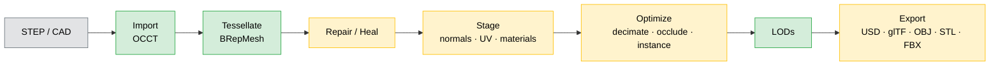

# Fascat Plan

The single planning document for Fascat. For the log of shipped work, see
[CHANGELOG.md](../CHANGELOG.md). This file tracks **what the pipeline does today** and
**what is still open**.

## What Fascat Is

A Python library and CLI that converts CAD (STEP, IGES, BREP) into realtime-ready OpenUSD,
glTF/GLB, OBJ, STL, and FBX assets. The end-to-end V1 pipeline is implemented and produces
real geometry — not just diagnostics. The goal is solid **CAD → realtime 3D (RT3D)**
basics, refined over time. Matching Unity's Asset Transformer 100% is explicitly a
non-goal; Unity Asset Transformer is used as a reference checklist, not a target.

## Pipeline at a Glance

**Legend** — 🟢 green: fully real · 🟡 amber: real core with an approximate or
metadata-only sub-feature · ⚪ grey: external input.

Backends: OCCT/OCP (CAD + tessellation + BREP healing), xatlas (UV unwrap
and packing), meshoptimizer / fast-simplification (decimation + meshopt
compression), Pillow (raster texture baking), glTF Transform + ktx2-encoder
(Draco and KTX2/Basis export), usd-core (USD), built-in glTF/OBJ/STL/FBX
writers, trimesh + numpy (mesh ops).

## Status: Real vs. Gaps

### Maturity matrix

| Stage | Real & complete | Approximate (refine) | Gap (metadata-only / not implemented) |
| --- | --- | --- | --- |
| **Import** | STEP hierarchy, transforms, colors, metadata, units, repeated-part instances; IGES XDE hierarchy/material import; native BREP single-shape import | — | typed PMI, multi-file/multi-root, design variants, other non-STEP formats |
| **Tessellate** | sag / angle / min-edge / curvature-adaptive meshing, CAD UV extraction/projected fallback, tessellation-time tangents, free-edge geometry metadata | CAD UV projection fallback | intrinsic/conformal CAD UV solver, auto per-part tessellation criteria |
| **Repair / Heal** | vertex merge, dedup, degenerate cleanup, winding fix, small-hole fill, normals; mesh T-junction sewing, boundary-gap stitching, non-manifold cracking, sliver removal, viewer/open-shell orientation; BREP fix-edge / sew | mesh-level hole removal, open-shell component orientation | BREP duplicate-face cleanup, tolerance overlap / z-fighting cleanup, non-orientable strip cracking |
| **Stage / UV** | normals, tangents, xatlas unwrap + bake-domain packing/padding, AABB UV, UV copy, material PBR normalize / merge | solver policy intent | island merge / align, seam graph, backend-enforced solver controls |
| **Materials** | per-face colors + PBR factors preserved, first-class image resources, raster material atlas baking, source image resize/dedupe/PNG-JPEG fallback processing | source texture sidecar extraction, CAD material-name PBR rule mapping, sampled AO bake | high-poly transfer, rich vendor material-library import |
| **Optimize** | decimation, quality target-error simplification, instance reconstruction, buffer optimization | sampled occlusion | weighted decimation, retopology, GPU occlusion |
| **LOD** | real decimated mesh levels, occurrence-aware LOD metadata, far-LOD one-material bake policy, engine switch-distance validation, scene-level far proxy mesh | per-part and scene proxy bake policies | format-specific engine LOD export profiles beyond metadata |
| **Export** | USD/USDZ, glTF/GLB (quantize + meshopt + Draco + KTX2/Basis), OBJ, STL, FBX, real baked texture images | — | size-ladder reports, named presets |

### A. Works end-to-end — real geometry

The basics are present and produce a valid RT3D asset:

- **Import** (`io/step.py`, `io/iges.py`, `io/brep.py`, OCCT/OCP): STEP geometry, STEP/IGES assembly hierarchy where exposed, transforms, colors, metadata, units, repeated-part instances, native BREP single-shape import, source-space normalization, sidecar source texture reference extraction, and first-pass CAD material-name PBR mapping.
- **Tessellate** (`ops/tessellate.py`, OCCT `BRepMesh`): `sag`, `angle`, `min_edge_length`, `curvature_adaptive`, `preserve_boundaries`, CAD UV extraction/projected fallback, tessellation-time tangents, and free-edge geometry metadata all change or annotate the real mesh.
- **Repair — mesh** (`mesh.py`): vertex merge (Euclidean union-find), duplicate / degenerate face removal, T-junction sewing, boundary-gap stitching, non-manifold edge cracking, sliver-face removal, winding fix (trimesh + inward-shell flip), viewer/open-shell orientation, small-hole fill, normal generation.
- **Heal — BREP** (`ops/heal.py`): `fix_edges`, `unify_tolerances`, `sew_faces` via OCCT `ShapeFix` / `BRepBuilderAPI_Sewing`.
- **Stage** (`ops/stage.py`): normals, tangents, UV unwrap/repack/padding (**xatlas**), AABB/box UV projection, UV copy, material normalize-to-PBR, duplicate-material merge.
- **Materials** (`ops/actions.py`, `ops/textures.py`, `image.py`): material bake creates first-class PNG images and raster atlas maps for base color, opacity, metallic/roughness, normal, AO, and emissive; texture processing resizes, dedupes, and applies PNG/JPEG fallback policy to first-class images; imported source textures can bind to material texture slots for glTF/USD export.
- **Optimize** (`ops/optimize.py`, `ops/actions.py`): decimation (**meshoptimizer / fast-simplification**) including quality target-error bounds, instance reconstruction (real scene rewrite), buffer optimization.
- **LODs** (`ops/lod.py`): real decimated mesh levels per part, occurrence-aware reuse metadata, far-level one-material bake policy, optional scene-level far proxy mesh, and engine-specific switch-distance metadata.
- **Export** (`io/{usd,gltf,obj,stl,fbx}.py`): USD/USDZ (usd-core), glTF/GLB with real quantization, meshopt, Draco, and KTX2/Basis paths, OBJ, STL, FBX — all write valid geometry, hierarchy, transforms, material factors, and referenced baked textures.

### B. Real but approximate — refine candidates

- **Occlusion removal** (`ops/actions.py`): real sampled visibility rays with CPU BVH acceleration; no GPU/raster backend, so thin occluders are imprecise.
- **Hole removal** (`actions.py:190,194`): mesh boundary classification + fill only; closed BREP feature removal not implemented.

### C. Metadata-only / not implemented — the genuine gaps

The remaining reportable gaps are now concentrated outside the core mesh pipeline:

- **Import enrichment**: typed AP242 PMI, design variants, and true multi-file/multi-root import are not implemented. Source texture extraction exists for referenced sidecar image files, but not for every vendor-specific CAD material-library container.
- **Advanced CAD attributes**: intrinsic/conformal CAD UV solving and automatic material/metadata/curvature-driven tessellation criteria are still open.
- **BREP cleanup**: duplicate-face cleanup, tolerance overlap / z-fighting cleanup, and open-shell grouping before BREP healing are still open.
- **Runtime validation**: reports include measured pipeline/write/validate timings and local memory/load/frame/FPS estimates, but no real Unity/Unreal/browser runtime harness exists yet.
- **Visual validation**: before/after preview renders and LOD switching screenshots are still open.

### D. Intentional deferrals — see [Deferrals](#deferrals).

## Roadmap

This is the master TODO list. Keep items in one of three states:

- `[x]` done in code, tests, docs/plan, and CI.
- `[~]` real but partial; useful, tested, and honestly documented.
- `[ ]` missing or not wired into the pipeline yet.

**Import**
- [x] IGES input (`.igs`, `.iges`) with XDE hierarchy/material import. Done 2026-05-31.
- [x] Native BREP input (`.brep`) as a single-shape source. Done 2026-05-31.
- [ ] True multi-file/multi-root import with deterministic namespaces and per-member warnings.
- [ ] Typed AP242 PMI extraction plus optional visual annotation geometry.
- [ ] Design-variant import.
- [ ] Mixed BREP construction-curve policy: delete / preserve metadata / tessellate tubes.
- [ ] Connect delete-patch import decisions to tessellation-time BREP retention.

**Tessellate**
- [x] CAD UV extraction from OCCT triangulation UV nodes with deterministic projected fallback. Done 2026-05-31.
- [x] Tessellation-time tangent generation from generated UV0. Done 2026-05-31.
- [x] Optional free-edge geometry metadata output for wire overlays. Done 2026-05-31.
- [~] CAD-derived UV generation: current fallback is projected, not a full intrinsic/conformal surface UV solver.
- [ ] Auto-apply material / metadata / curvature-driven per-part tessellation criteria. Today this is advisory-only.

**Repair / Heal**
- [x] Mesh T-junction sewing. Done 2026-05-31.
- [x] Mesh boundary-gap stitching. Done 2026-05-31.
- [x] Mesh non-manifold edge cracking. Done 2026-05-31.
- [x] Mesh sliver-face removal. Done 2026-05-31.
- [x] Viewer-standpoint face/normal orientation and open-shell/unstitched component winding. Done 2026-05-31.
- [ ] BREP duplicate-face cleanup and tolerance overlap / z-fighting cleanup.
- [ ] Optional non-orientable strip cracking before face orientation.
- [ ] Open-shell grouping before BREP healing; standalone patch-cleanup expert operations.

**Stage / UV**
- [x] Real UV repack + padding for bake domains (UV1 / lightmap). Done 2026-05-31.
- [ ] UV island merge + alignment for tileable UV0; seam segmentation + lines-of-interest seam graph.
- [ ] Backend-enforced solver controls: conformal / isometric, seam, and overlap policies.
- [ ] Topology-only connectivity vertex merge with split render attributes.

**Materials & textures**
- [x] Real raster texture baking: base color, roughness, metallic, normal, AO, emissive. Done 2026-05-31.
- [x] Real atlas packing with first-class image resources. Done 2026-05-31.
- [x] Image resize/dedupe passes and PNG/JPEG fallback conversion policy for first-class images. Done 2026-05-31.
- [~] Source texture pipeline: CAD import now extracts referenced sidecar PNG/JPEG/KTX2 files and binds semantic slots, but vendor-specific embedded material-library containers are still partial. Updated 2026-05-31.
- [ ] AO bake to texture and/or vertex colors feeding decimation weights.
- [~] Material-library import + CAD-material-to-PBR mapping tables + diagnostics: XDE visual material values and common CAD material-name rules are mapped to PBR factors; rich vendor material libraries are still open. Updated 2026-05-31.
- [ ] High-poly → proxy normal-map baking.

**Optimize**
- [x] Geometric-error-bounded simplification replacing quality-heuristic ratio mapping. Done 2026-05-31.
- [ ] AO / user-painted vertex weights as simplification constraints; vertex-color/weight cleanup.
- [ ] Optional raster/GPU occlusion backend; standard vs advanced params.
- [ ] Loose / precise + symmetry / mirror-aware instance reconstruction.
- [ ] Retopology / proxy-mesh paths and normal-map transfer.

**LOD**
- [x] Occurrence-aware LOD metadata preserving instance relationships across levels. Done 2026-05-31.
- [x] Far-LOD one-material bake policy per part. Done 2026-05-31.
- [x] Switching-distance validation + generic/Unity/Unreal distance profiles. Done 2026-05-31.
- [~] Per-LOD material / texture-resolution / culling policy: material bake and culling metadata exist, texture-resolution policy is still advisory.
- [x] Scene-level far proxy as one mesh / one material / one draw call, with glTF root LOD metadata. Done 2026-05-31.
- [ ] Format-specific engine LOD export profiles beyond metadata.

**Export**
- [x] FBX ASCII output. Done 2026-05-31.
- [x] Real Draco encoder path. Done 2026-05-31.
- [x] Real KTX2/Basis texture output. Done 2026-05-31.
- [ ] Baseline-vs-optimized + compressed-GLB size-ladder reports.
- [ ] Named web / mobile / desktop / VR / AR export presets that apply compression + resize + cleanup.

**Validation (cross-cutting)**
- [x] Measured pipeline/write/validate timings in profile budget reports. Done 2026-05-31.
- [x] Runtime memory/load/frame/FPS budget reporting with local estimates. Done 2026-05-31.
- [~] Runtime profiling: local measured timings exist, but real engine/browser measured FPS is not implemented.
- [ ] Visual before/after preview renders and LOD switching checks.
- [ ] Real Unity/Unreal/browser runtime load-time, memory, and FPS harness.

## Principles

- Keep the public API small, explicit, and Pythonic.
- Preserve CAD hierarchy, transforms, names, colors, metadata, and instancing by default.
- Make lossy or approximate steps explicit in options, docs, and reports.
- Prefer warnings and partial success over silent data loss.
- Use proven geometry libraries for CAD kernels, tessellation, simplification, UV packing, and USD authoring.
- Work one feature at a time: implement, test, document, commit, push, verify CI/docs.

## Deferrals

Intentionally out of scope until a user need changes the priority:

- Non-STEP CAD formats beyond the supported IGES and native BREP paths: Parasolid, JT, CATIA, NX, SolidWorks, IFC, 3MF, QIF.
- Animation / skinning / morph targets / animated GLB passthrough.
- Convex decomposition and physics proxy generation.
- Advanced retopology and subdivision workflows.
- GPU-specific runtime packaging beyond standards-aligned glTF/USD output.

## Operating Checklist

For each planned feature:

1. Confirm the intended behavior in docs or tests first.
2. Keep the change scoped to one user-visible outcome.
3. Add or update focused tests.
4. Update API/reference docs when public behavior changes.
5. Run `make fmt-check`, `make lint`, `make docs`, and `make ci`.
6. Commit with the repo convention.
7. Push and verify GitHub CI and Docs workflows are green.
