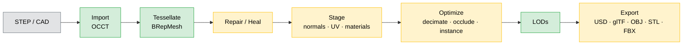

# Fascat Plan

The single planning document for Fascat. For the log of shipped work, see
[CHANGELOG.md](../CHANGELOG.md). This file tracks **what the pipeline does today** and
**what is still open**.

## What Fascat Is

A Python library and CLI that converts CAD (STEP, IGES, BREP) into realtime-ready OpenUSD,
glTF/GLB, OBJ, STL, and FBX assets. The end-to-end V1 pipeline is implemented and produces
real geometry — not just diagnostics. The goal is solid **CAD → realtime 3D (RT3D)**
basics, refined over time. Matching Unity's Asset Transformer 100% is explicitly a
non-goal; Unity Asset Transformer is used as a reference checklist, not a target.

## Pipeline at a Glance

**Legend** — 🟢 green: fully real · 🟡 amber: real core with an approximate or
metadata-only sub-feature · ⚪ grey: external input.

Backends: OCCT/OCP (CAD + tessellation + BREP healing), xatlas (UV unwrap
and packing), meshoptimizer / fast-simplification (decimation + meshopt
compression), Pillow (raster texture baking), glTF Transform + ktx2-encoder
(Draco and KTX2/Basis export), usd-core (USD), built-in glTF/OBJ/STL/FBX
writers, trimesh + numpy (mesh ops).

## Status: Real vs. Gaps

### Maturity matrix

| Stage | Real & complete | Approximate (refine) | Gap (metadata-only / not implemented) |
| --- | --- | --- | --- |
| **Import** | STEP hierarchy, transforms, colors, metadata, units, repeated-part instances; explicit multi-root STEP path-list import; quoted external-reference STEP graph discovery/merge from a master file; IGES XDE hierarchy/material import; native BREP single-shape import | deeper vendor-specific external-reference placement semantics | typed PMI, design variants, other non-STEP formats |
| **Tessellate** | sag / angle / min-edge / curvature-adaptive meshing, material/metadata-driven detail-adaptive per-part criteria, CAD UV extraction/projected fallback, tessellation-time tangents, free-edge geometry metadata | CAD UV projection fallback | intrinsic/conformal CAD UV solver, curvature-only auto criteria |
| **Repair / Heal** | vertex merge, dedup, degenerate cleanup, winding fix, small-hole fill, normals; mesh T-junction sewing, boundary-gap stitching, non-manifold cracking, sliver removal, viewer/open-shell orientation; BREP fix-edge / sew / same-domain cleanup / coplanar overlap cleanup | mesh-level hole removal, open-shell component orientation | non-orientable strip cracking |
| **Stage / UV** | normals, tangents, xatlas unwrap + bake-domain packing/padding, AABB UV, UV copy, seam graph metadata, material PBR normalize / merge | solver policy intent | island merge / align, backend-enforced solver controls |
| **Materials** | per-face colors + PBR factors preserved, first-class image resources, raster material atlas baking, alpha/effective-opacity export cleanup, source image resize/dedupe/PNG-JPEG fallback processing, JSON/MTL/ZIP vendor material-library import | source texture sidecar extraction, CAD material-name PBR rule mapping, sampled AO bake | high-poly transfer, closed/proprietary vendor material-library containers |
| **Optimize** | decimation, quality target-error simplification, painted/AO protected-face decimation constraints, instance reconstruction, buffer optimization | sampled occlusion | continuous weighted decimation, retopology, GPU occlusion |
| **LOD** | real decimated mesh levels, occurrence-aware LOD metadata, far-LOD one-material bake policy, engine switch-distance validation, scene-level far proxy mesh | per-part and scene proxy bake policies | format-specific engine LOD export profiles beyond metadata |
| **Export** | USD/USDZ, glTF/GLB (quantize + meshopt + Draco + KTX2/Basis), GLB size-ladder reports, named export presets, OBJ, STL, FBX, real baked texture images | — | — |
| **Validation** | output validators, geometry analysis, profile budget estimates, optional headless browser/WebGL glTF runtime measurement, optional browser/WebGL rendered screenshots for supported glTF/GLB primitives with quantized attribute support, Draco decode via glTF Transform, meshopt fallback-buffer support, meshopt-only/no-fallback decode via local meshoptimizer, optional KTX2/Basis texture decode via Python `alktx2` or glTF Transform plus KTX-Software, optional KHR_texture_basisu fixtures with PNG fallback screenshots, base-color texture sampling, and compressed-extension preflight diagnostics, optional packaged or project-backed Unity/Unreal runtime harness drivers with Unity/glTFast preview screenshots/FPS, Unreal commandlet geometry-rasterized GLB preview PNG/FPS with backend/limitation reporting, custom-harness preview artifact reporting, engine-preview baseline image-diff thresholds, deterministic software preview PNGs and LOD contact sheets, bundled runtime parity GLB/software-baseline fixture generation for PBR material, texture-map, KTX2/Basis fallback, and normal/lighting checks, and local capture/promote/require workflow for browser/Unity/Unreal target goldens | browser runtime harness uses a bounded triangle proxy workload; browser KTX2/Basis texture decode depends on optional `alktx2` or external KTX-Software availability and falls back to PNG texture sources or geometry-only partial previews when unavailable; packaged Unity preview is a fixed multi-frame camera render; packaged Unreal preview is a deterministic commandlet GLB geometry/baseColorFactor rasterizer with fixed-frame software benchmark rather than a full scene/material/texture renderer; target-golden validation exists but the repo still needs checked-in real engine material/lighting image corpora; preview renderer is orthographic software shading | full Unreal scene renderer screenshots/FPS, fallback-free default KTX2/Basis texture decode, and checked-in engine-specific Unity/Unreal material/lighting golden corpora |

### A. Works end-to-end — real geometry

The basics are present and produce a valid RT3D asset:

- **Import** (`io/step.py`, `io/iges.py`, `io/brep.py`, OCCT/OCP): STEP geometry, explicit multi-root STEP path-list import, master STEP quoted external-reference graph discovery/merge, STEP/IGES assembly hierarchy where exposed, transforms, colors, metadata, units, repeated-part instances, native BREP single-shape import, source-space normalization, sidecar source texture reference extraction, and first-pass CAD material-name PBR mapping.
- **Tessellate** (`ops/tessellate.py`, OCCT `BRepMesh`): `sag`, `angle`, `min_edge_length`, `curvature_adaptive`, material/metadata-driven detail-adaptive per-part settings, `preserve_boundaries`, CAD UV extraction/projected fallback, tessellation-time tangents, and free-edge geometry metadata all change or annotate the real mesh.
- **Repair — mesh** (`mesh.py`): vertex merge (Euclidean union-find), duplicate / degenerate face removal, T-junction sewing, boundary-gap stitching, non-manifold edge cracking, sliver-face removal, winding fix (trimesh + inward-shell flip), viewer/open-shell orientation, small-hole fill, normal generation.
- **Heal — BREP** (`ops/heal.py`): `fix_edges`, `unify_tolerances`, `sew_faces`, same-domain face/edge cleanup, and coplanar overlap/z-fighting face cleanup via OCCT `ShapeFix`, `BRepBuilderAPI_Sewing`, `ShapeUpgrade_UnifySameDomain`, and `BRepTools_ReShape`.
- **Stage** (`ops/stage.py`): normals, tangents, UV unwrap/repack/padding (**xatlas**), AABB/box UV projection, UV copy, UV seam graph metadata, material normalize-to-PBR, duplicate-material merge.
- **Materials** (`ops/actions.py`, `ops/textures.py`, `image.py`, `io/step.py`): material bake creates first-class PNG images and raster atlas maps for base color, opacity, metallic/roughness, normal, AO, and emissive; exporters use effective opacity consistently across scalar alpha channels; texture processing resizes, dedupes, and applies PNG/JPEG fallback policy to first-class images; imported source textures and JSON/MTL material-library records, including ZIP packages with embedded textures, can bind to material texture slots for glTF/USD export.
- **Optimize** (`ops/optimize.py`, `ops/actions.py`): decimation (**meshoptimizer / fast-simplification**) including quality target-error bounds and painted/AO protected-face constraints, instance reconstruction (real scene rewrite), buffer optimization.
- **LODs** (`ops/lod.py`): real decimated mesh levels per part, occurrence-aware reuse metadata, far-level one-material bake policy, optional scene-level far proxy mesh, and engine-specific switch-distance metadata.
- **Export** (`io/{usd,gltf,obj,stl,fbx}.py`): USD/USDZ (usd-core), glTF/GLB with real quantization, meshopt, Draco, and KTX2/Basis paths, OBJ, STL, FBX — all write valid geometry, hierarchy, transforms, material factors, and referenced baked textures.

### B. Real but approximate — refine candidates

- **Occlusion removal** (`ops/actions.py`): real sampled visibility rays with CPU BVH acceleration; no GPU/raster backend, so thin occluders are imprecise.
- **Hole removal** (`actions.py:190,194`): mesh boundary classification + fill only; closed BREP feature removal not implemented.

### C. Metadata-only / not implemented — the genuine gaps

The remaining reportable gaps are now concentrated outside the core mesh pipeline:

- **Import enrichment**: explicit multi-root STEP path-list import exists with deterministic namespaces and per-member warnings. Master STEP quoted external `.step` / `.stp` reference graphs are discovered recursively and merged through the same deterministic member path; deeper vendor-specific placement semantics around those references remain approximate. Typed AP242 PMI and design variants are not implemented. Source texture extraction exists for referenced sidecar image files. JSON/MTL material-library records, including ZIP packages with embedded textures, can now map PBR factors and texture slots, but closed/proprietary CAD material-library containers remain open.
- **Advanced CAD attributes**: intrinsic/conformal CAD UV solving and curvature-only automatic tessellation criteria are still open.
- **BREP cleanup**: same-domain face/edge cleanup and conservative coplanar overlap / z-fighting face cleanup exist; open-shell grouping before BREP healing is still open.
- **Runtime validation**: reports include measured pipeline/write/validate timings and local memory/load/frame/FPS estimates, plus optional headless browser/WebGL and packaged or project-backed Unity/Unreal glTF runtime harness drivers. The packaged Unity harness can now load and instantiate GLB/GLTF through glTFast, render a fixed multi-frame camera loop when graphics are available, write the requested preview PNG, and report render-status/FPS fields; the packaged Unreal commandlet parses GLB/GLTF counts and can rasterize supported GLB triangle geometry plus material `baseColorFactor` into a deterministic preview PNG/FPS report with explicit backend/limitation fields; project-backed harnesses can return the same preview contract. Engine preview baselines can now fail validation through image-diff thresholds, and `runtime-fixtures` writes bundled PBR material, texture-map, optional KTX2/Basis fallback, and normal/lighting GLB fixtures with software baselines, browser/Unity/Unreal preview commands, local capture reports, promoted target goldens, and required-golden validation. Full Unreal scene rendering/FPS and checked-in engine-specific material/lighting golden corpora are still open.
- **Visual validation**: deterministic before/after software preview PNGs, LOD switching contact sheets, baseline image-diff thresholds, packaged Unreal commandlet geometry-rasterized GLB previews, engine-preview baseline diffs, runtime parity fixture generation/capture, and browser/WebGL rendered screenshots for supported glTF/GLB primitives exist with quantized vertex attributes, Draco decode via glTF Transform, meshopt fallback-buffer support, meshopt-only/no-fallback decode via local meshoptimizer, optional KTX2/Basis texture decode via Python `alktx2` or glTF Transform plus KTX-Software, optional KHR_texture_basisu fixtures with PNG fallback screenshots, base-color texture sampling for supported image URI/data URI textures, and explicit unsupported/partial reports for missing geometry/texture decode tooling; fallback-free default KTX2/Basis decode, full Unreal scene renderer screenshots, and checked-in engine-specific material/lighting golden corpora are still open.

### D. Intentional deferrals — see [Deferrals](#deferrals).

## Roadmap

This is the master TODO list. Keep items in one of three states:

- `[x]` done in code, tests, docs/plan, and CI.
- `[~]` real but partial; useful, tested, and honestly documented.
- `[ ]` missing or not wired into the pipeline yet.

**Import**
- [x] IGES input (`.igs`, `.iges`) with XDE hierarchy/material import. Done 2026-05-31.
- [x] Native BREP input (`.brep`) as a single-shape source. Done 2026-05-31.
- [~] True multi-file/multi-root import with deterministic namespaces and per-member warnings: explicit STEP path lists are supported in Python APIs, `convert([...], output)`, and CLI `convert root-a.step out.glb --input root-b.step`; single-master imports with `multi_file=True` / `--multi-file-import` now recursively resolve quoted external `.step` / `.stp` references and report resolved/missing/unsupported graph records. Deeper vendor-specific placement semantics remain open. Updated 2026-05-31.
- [ ] Typed AP242 PMI extraction plus optional visual annotation geometry.
- [ ] Design-variant import.
- [ ] Mixed BREP construction-curve policy: delete / preserve metadata / tessellate tubes.
- [ ] Connect delete-patch import decisions to tessellation-time BREP retention.

**Tessellate**
- [x] CAD UV extraction from OCCT triangulation UV nodes with deterministic projected fallback. Done 2026-05-31.
- [x] Tessellation-time tangent generation from generated UV0. Done 2026-05-31.
- [x] Optional free-edge geometry metadata output for wire overlays. Done 2026-05-31.
- [~] CAD-derived UV generation: current fallback is projected, not a full intrinsic/conformal surface UV solver.
- [~] Auto-apply material / metadata / curvature-driven per-part tessellation criteria: `detail_adaptive` now turns shiny/high-detail material and metadata detection into per-part `sag_ratio=0.01` plus `curvature_adaptive=True`, while curvature-only targeting is still open. Updated 2026-05-31.

**Repair / Heal**
- [x] Mesh T-junction sewing. Done 2026-05-31.
- [x] Mesh boundary-gap stitching. Done 2026-05-31.
- [x] Mesh non-manifold edge cracking. Done 2026-05-31.
- [x] Mesh sliver-face removal. Done 2026-05-31.
- [x] Viewer-standpoint face/normal orientation and open-shell/unstitched component winding. Done 2026-05-31.
- [x] BREP duplicate-face cleanup and tolerance overlap / z-fighting cleanup: OCCT same-domain face/edge cleanup exists for neighboring coincident domains; coplanar overlap cleanup detects projected overlap and removes redundant z-fighting faces with `BRepTools_ReShape`. Done 2026-05-31.
- [ ] Optional non-orientable strip cracking before face orientation.
- [ ] Open-shell grouping before BREP healing; standalone patch-cleanup expert operations.

**Stage / UV**
- [x] Real UV repack + padding for bake domains (UV1 / lightmap). Done 2026-05-31.
- [~] UV island merge + alignment for tileable UV0; seam graph metadata now records duplicated-position UV seam edges, components, vertices, and lengths. Island merge/alignment is still open. Updated 2026-06-01.
- [ ] Backend-enforced solver controls: conformal / isometric, seam, and overlap policies.
- [ ] Topology-only connectivity vertex merge with split render attributes.

**Materials & textures**
- [x] Real raster texture baking: base color, roughness, metallic, normal, AO, emissive. Done 2026-05-31.
- [x] Real atlas packing with first-class image resources. Done 2026-05-31.
- [x] Image resize/dedupe passes and PNG/JPEG fallback conversion policy for first-class images. Done 2026-05-31.
- [~] Source texture pipeline: CAD import now extracts referenced sidecar PNG/JPEG/KTX2 files and binds semantic slots; JSON/MTL material-library sidecars and ZIP packages can also load texture slots. Closed/proprietary vendor material-library containers are still open. Updated 2026-05-31.
- [~] AO bake to texture exists and low-AO faces can feed decimation protection; vertex-color output and continuous decimation weights remain open. Updated 2026-06-01.
- [~] Material-library import + CAD-material-to-PBR mapping tables + diagnostics: XDE visual material values, common CAD material-name rules, JSON/MTL sidecar material libraries, and ZIP packages with embedded textures are mapped to PBR factors and texture slots with resolved/matched/unmatched diagnostics; closed/proprietary vendor material-library containers are still open. Updated 2026-05-31.
- [ ] High-poly → proxy normal-map baking.

**Optimize**
- [x] Geometric-error-bounded simplification replacing quality-heuristic ratio mapping. Done 2026-05-31.
- [~] AO / user-painted vertex weights as simplification constraints; vertex-color/weight cleanup: painted/protected face groups, metadata face indices, and low-AO faces now become protected simplification constraints. Continuous vertex-weight simplification and vertex-color/weight cleanup remain open. Updated 2026-06-01.
- [ ] Optional raster/GPU occlusion backend; standard vs advanced params.
- [ ] Loose / precise + symmetry / mirror-aware instance reconstruction.
- [ ] Retopology / proxy-mesh paths and normal-map transfer.

**LOD**
- [x] Occurrence-aware LOD metadata preserving instance relationships across levels. Done 2026-05-31.
- [x] Far-LOD one-material bake policy per part. Done 2026-05-31.
- [x] Switching-distance validation + generic/Unity/Unreal distance profiles. Done 2026-05-31.
- [~] Per-LOD material / texture-resolution / culling policy: material bake and culling metadata exist, texture-resolution policy is still advisory.
- [x] Scene-level far proxy as one mesh / one material / one draw call, with glTF root LOD metadata. Done 2026-05-31.
- [ ] Format-specific engine LOD export profiles beyond metadata.

**Export**
- [x] FBX ASCII output. Done 2026-05-31.
- [x] Real Draco encoder path. Done 2026-05-31.
- [x] Real KTX2/Basis texture output. Done 2026-05-31.
- [x] Baseline-vs-optimized + compressed-GLB size-ladder reports. Done 2026-05-31.
- [x] Named web / mobile / desktop / VR / AR export presets that apply compression + resize + cleanup. Done 2026-05-31.

**Validation (cross-cutting)**
- [x] Measured pipeline/write/validate timings in profile budget reports. Done 2026-05-31.
- [x] Runtime memory/load/frame/FPS budget reporting with local estimates. Done 2026-05-31.
- [~] Runtime profiling: local measured timings, optional headless browser/WebGL glTF load/FPS measurements, and optional packaged or project-backed Unity/Unreal harness drivers exist; the packaged Unity harness can return a glTFast camera preview PNG plus fixed multi-frame render FPS, and the packaged Unreal commandlet can return a supported-GLB geometry/baseColorFactor rasterized preview PNG plus fixed-frame software benchmark with backend/limitation fields. Engine preview baseline thresholds can now gate rendered preview drift, and bundled runtime parity fixtures plus local capture/promote/require target-golden reports can seed material/lighting and KTX2/Basis fallback comparisons. Full Unreal scene rendering/FPS and checked-in engine-specific material/lighting golden corpora are still open. Updated 2026-06-01.
- [~] Visual before/after preview renders and LOD switching checks: deterministic software preview PNGs, output validation previews, LOD contact sheets, baseline image-diff thresholds, packaged Unreal commandlet geometry-rasterized GLB previews, engine-preview baseline diffs, bundled runtime parity fixture generation/capture, and browser/WebGL screenshots for supported glTF/GLB primitives exist; browser screenshots now handle quantized vertex attributes, Draco geometry through a glTF Transform decode prepass, meshopt exports with fallback buffer data, meshopt-only/no-fallback bufferViews through a local meshoptimizer decode prepass, optional KTX2/Basis texture decode through Python `alktx2` or glTF Transform plus KTX-Software, optional KHR_texture_basisu fixtures with PNG fallback screenshots, and supported base-color image URI/data URI textures. Fallback-free default KTX2/Basis decode, full Unreal scene renderer screenshots, and checked-in engine-specific material/lighting golden corpora remain open. Updated 2026-06-01.
- [~] Real Unity/Unreal/browser runtime load-time, memory, and FPS harness: browser/WebGL glTF harness exists with bounded triangle proxy workload; Unity/Unreal command drivers can use packaged temporary harness templates or configured Fascat runtime harness projects, and custom harnesses can receive preview PNG paths plus return render-status/backend/limitation fields. The packaged Unity harness uses glTFast to render a fixed multi-frame preview PNG/FPS loop; the packaged Unreal commandlet returns a deterministic GLB geometry/baseColorFactor rasterized preview PNG/FPS loop when requested. Full Unreal scene rendering and Unreal renderer FPS remain open. Updated 2026-06-01.

## Principles

- Keep the public API small, explicit, and Pythonic.
- Preserve CAD hierarchy, transforms, names, colors, metadata, and instancing by default.
- Make lossy or approximate steps explicit in options, docs, and reports.
- Prefer warnings and partial success over silent data loss.
- Use proven geometry libraries for CAD kernels, tessellation, simplification, UV packing, and USD authoring.
- Work one feature at a time: implement, test, document, commit, push, verify CI/docs.

## Deferrals

Intentionally out of scope until a user need changes the priority:

- Non-STEP CAD formats beyond the supported IGES and native BREP paths: Parasolid, JT, CATIA, NX, SolidWorks, IFC, 3MF, QIF.
- Animation / skinning / morph targets / animated GLB passthrough.
- Convex decomposition and physics proxy generation.
- Advanced retopology and subdivision workflows.
- GPU-specific runtime packaging beyond standards-aligned glTF/USD output.

## Operating Checklist

For each planned feature:

1. Confirm the intended behavior in docs or tests first.
2. Keep the change scoped to one user-visible outcome.
3. Add or update focused tests.
4. Update API/reference docs when public behavior changes.
5. Run `make fmt-check`, `make lint`, `make docs`, and `make ci`.
6. Commit with the repo convention.
7. Push and verify GitHub CI and Docs workflows are green.
